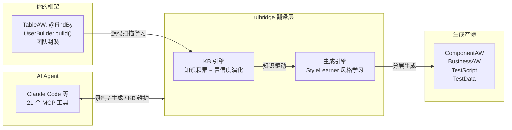
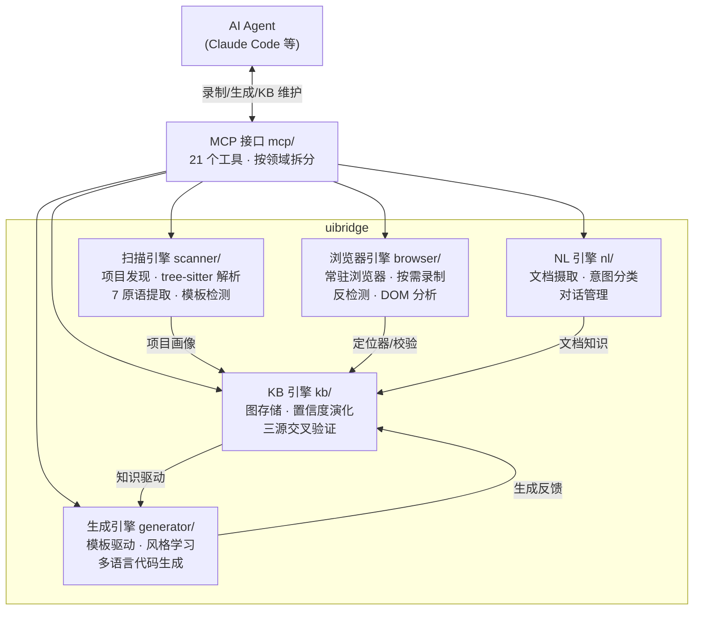
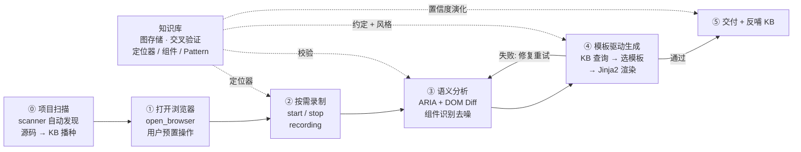
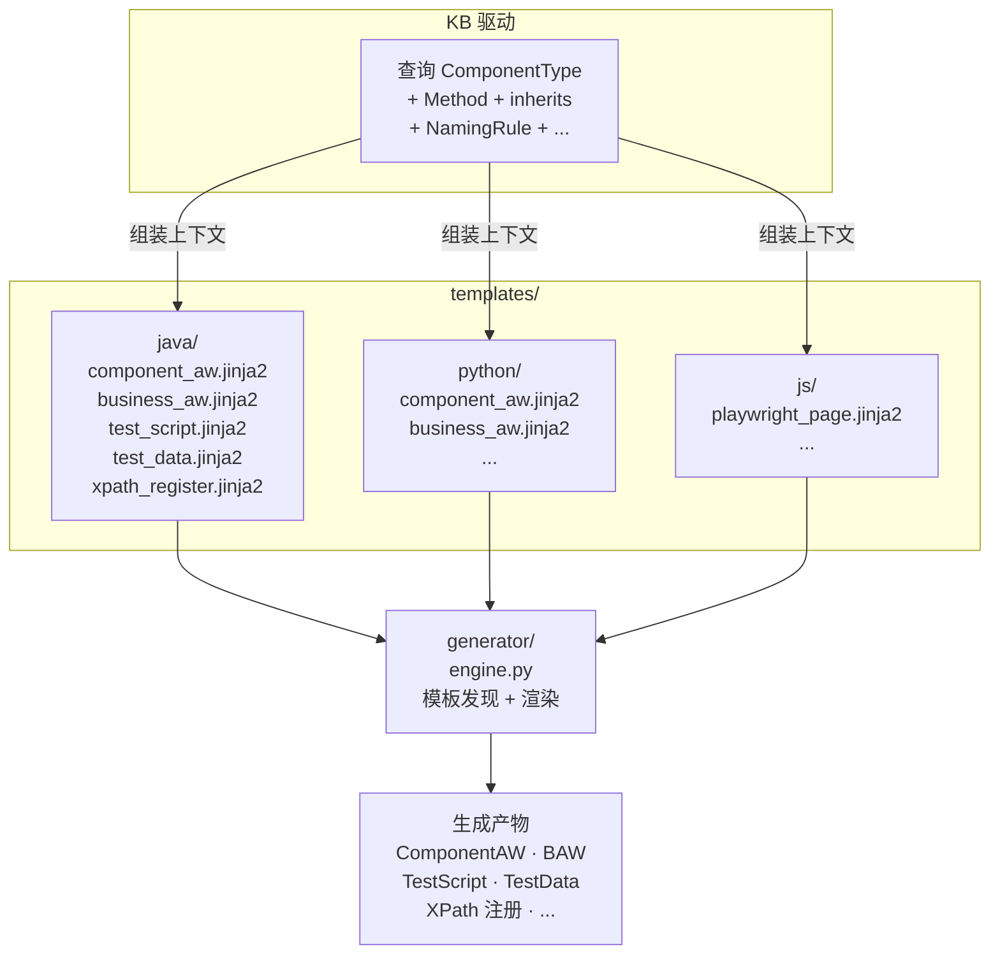

# uibridge

**给企业 UI 自动化框架装上 AI 接口。**

不改架构、不换框架、不重构。AI Agent 学习你团队的 TableAW、@FindBy、UserBuilder — 生成的测试与手写风格高度一致。



---

## 架构设计：引擎协作



（v0.4.1 已实现：五大引擎 + 录制全流程 + 模板引擎 + KB 对接；语义分析和 Kùzu 图数据库 v0.5.0）

| 引擎 | 目录 | 一句话职责 | v0.4.0 状态 |
|------|------|-----------|-------------|
| **扫描引擎** | `scanner/` | 自动发现项目结构，提取类继承、调用链、注解、定位器 | ✅ 主干已搭建 |
| **浏览器引擎** | `browser/` | 常驻浏览器 + 反检测 + 按需录制。人操作，系统观察 | ✅ 三段式录制全流程可用 |
| **KB 引擎** | `kb/` | 图存储 + 置信度演化 + 三源交叉验证。静默学习回路 | ✅ 图查询 + 交叉验证 |
| **NL 引擎** | `nl/` | 文档摄取 + 意图分类 + 对话管理。纯规则，零 LLM 依赖 | ✅ 主干已搭建 |
| **生成引擎** | `generator/` | 模板驱动 + StyleLearner 风格学习。多语言代码输出 | ✅ Jinja2 引擎 + 10 模板已对接 |
| **MCP 接口** | `mcp/` | 21 个 MCP 工具，按领域拆分（录制/生成/KB/画像/环境） | ✅ KB/Profile 已对接 |

---

## 四大核心价值

| 价值 | 说明 |
|------|------|
| **框架知识翻译** | 学习团队现有封装（TableAW、@FindBy、UserBuilder），生成的代码与手写风格一致。不是通用模板拼凑 |
| **模板驱动代码生成** | 按语言组织 Jinja2 模板目录（Java/Python/JS），每个模板自描述消费的 KB 节点和输出路径。新增文件类型只需加模板文件，不改引擎代码（v0.4.0 已实现 StyleLearner + Jinja2 CodeGenerator + 10 模板） |
| **知识持续演化** | 源码 × 浏览器 × NL 三源交叉验证。自检通过 +0.02，失败 -0.25，长期不用衰减。高置信度采纳，低置信度归档。越用越准（v0.4.0 已实现图存储 + 交叉验证） |
| **零侵入 + 最低成本** | 不改现有代码，不换框架。卸载：`uibridge cleanup --yes && pip uninstall uibridge -y` |

---

## 知识库 — 越用越准

一次性生成方案的 prompt 每次重写，知识随会话消失。uibridge 的 KB 是持久化资产，通过图结构组织团队知识：

| 机制 | 说明 |
|------|------|
| **多源知识注入** | scanner 源码扫描提取组件族和方法签名 + NL 对话注入团队约定 + 文档自动解析。知识以图结构持久化，节点和关系可查询可演化，团队可审查可修正（v0.4.0 已实现三源注入 + 图查询，YAML 存储） |
| **置信度演化** | 代码推断 × 浏览器观测 × 用户输入三源交叉验证。自检通过自动沉淀（confidence +0.02），失败标记降权（confidence -0.25）。长期未使用的知识自然衰减，低置信度条目自动归档（v0.4.0 已实现图存储 + 交叉验证；Kùzu 嵌入式图数据库 v0.5.0） |
| **NL 对话维护** | 21 个 MCP 工具覆盖 KB 全生命周期：`add_kb_rule` / `modify_kb_rule` / `delete_kb_rule` 结构化 CRUD，`update_knowledge_base` 自动识别意图（QUERY/ADD/MODIFY/DELETE）。支持 Markdown 文档批量摄取 |
| **自动模式挖掘** | PrefixSpan 频繁序列挖掘发现操作模式写入 KB，下次直接复用（v0.4.0 scanner 已实现 PrefixSpan 提取，端到端集成 v0.5.0） |
| **团队共享** | KB 条目携带来源标记（源码推断 / NL 注入 / 文档摄取 / 浏览器观测）和置信度，团队可审查和修正。知识以图结构组织，节点和关系可查询可演化（v0.4.0 YAML 存储，Kùzu 嵌入式图数据库 v0.5.0） |

---

## 工作流



（v0.4.0 已实现：①②④⑤；③语义分析 v0.5.0）

知识库贯穿全部阶段 — 录制时提供定位器，分析时校验组件置信度，生成时应用团队约定，自检结果反哺 KB。不是一次性 prompt，是持续积累的团队资产。

---

## 模板驱动，按需产出

生成引擎不是为每种产物写死 Python 代码，而是**模板驱动**：模板在 `templates/` 下按语言组织，每个模板自描述消费的 KB 节点和输出路径模式。新增文件类型只需加一个 `.jinja2` 模板文件。



**五类标准产物**（模板可扩展）：

| 产物 | 消费的 KB 节点 | 说明 |
|------|---------------|------|
| XPath 注册 | `FileFormat` + 定位器优先级 + 定位器取值 | 按文件格式模板渲染 |
| ComponentAW | `ComponentType` + `Method` + `inherits` 关系 | 按组件模板 + 方法模板 |
| BAW / 函数 | `OperationSequence` + `NamingRule` + `called_by` 链 | 按调用序列展开 |
| TestData | `FileFormat` + 字段规则 | 推断格式 + 模板渲染 |
| TestScript | 导入集合 + assertion 风格 + fixture 声明 | 统计采样决策 |

（v0.4.0 已实现：CodeGenerator 引擎 + 10 Jinja2 模板（Python/Java × 5 类型）；端到端录制→生成管线 v0.5.0）

---

## 快速开始

### 安装

```bash
git clone https://github.com/timgunnar/UIBridge.git && cd uibridge
pip install -e .
playwright install chromium

# 验证
uibridge --help
python -m pytest tests/ -v   # 643 个测试
```

### 接入现有项目

```bash
# 复制种子文件到你的项目
cp templates/CLAUDE.md    /path/to/your-project/
cp templates/.mcp.json    /path/to/your-project/
cp templates/adapter.yaml /path/to/your-project/.uibridge/

# 启动 Agent
cd /path/to/your-project && claude
```

Agent 启动后自动检测项目结构，扫描源码播种知识库，报告发现结果。

后续一切通过自然语言对话操作：让 AI 打开浏览器辅助操作、查询知识库、生成测试代码、注入团队约定。

### 卸载

```bash
uibridge cleanup --yes    # 清理所有生成文件
pip uninstall uibridge -y # 卸载 Python 包
```

---

## 许可证

MIT — 详见 [LICENSE](./LICENSE)
