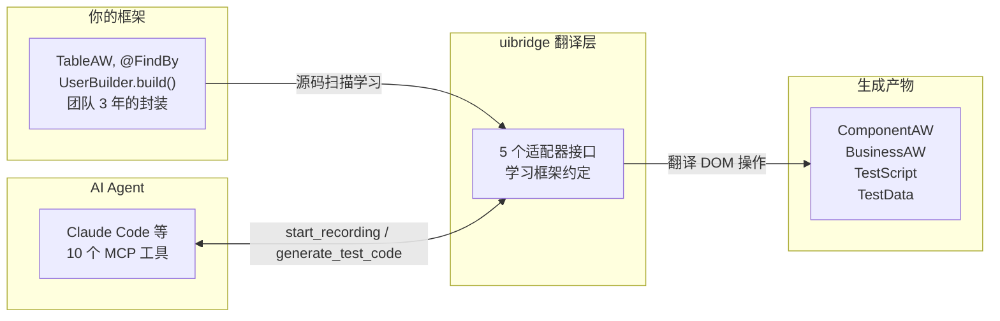
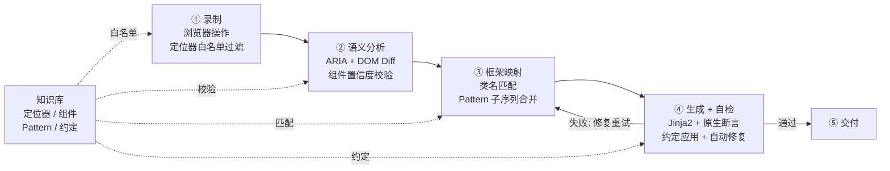
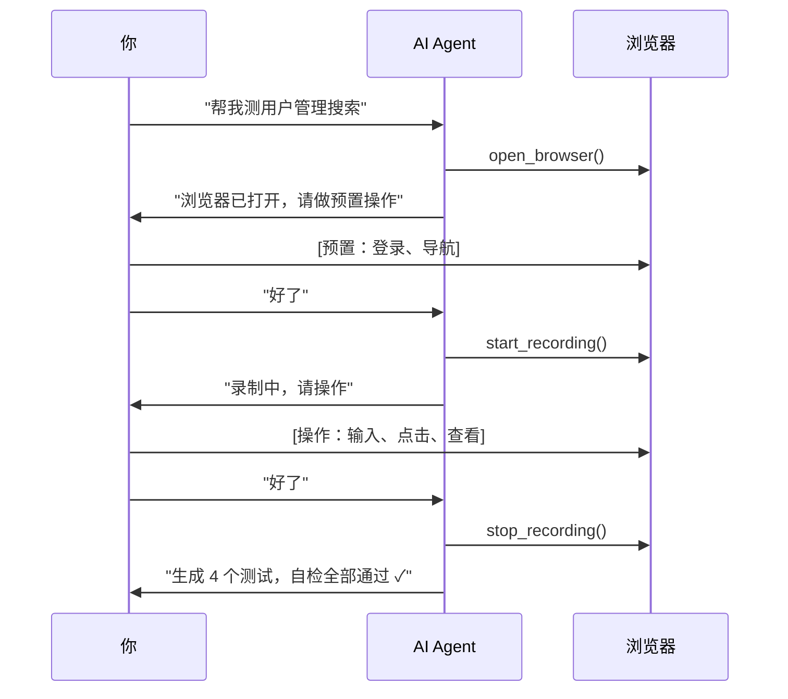

# uibridge

**给你的企业 UI 自动化框架装上 AI 接口。**

不改架构、不换框架、不重构。AI Agent 学习你团队的 TableAW、@FindBy、UserBuilder — 生成的测试与手写风格高度一致。



---

## 四大核心价值

| 价值 | 说明 |
|------|------|
| **框架知识库** | 自动扫描源码建立，自检反馈持续演化。NL 对话增删改查（"定位器用 data-testid"即刻生效）。每次生成自动挖掘 BAW 模式。YAML 存储、可 commit |
| **交互录制 → 分层代码** | 你在浏览器操作，AI 录制。内置多层噪声过滤（JS 防抖 + KB 白名单 + Pattern 匹配），生成 ComponentAW → BusinessAW → TestScript + TestData 四层结构，断言为框架原生风格 |
| **零侵入 + 最低成本** | 不碰现有代码，已有测试继续跑。卸载: `uibridge cleanup --yes && pip uninstall uibridge -y` |
| **全自动感知，对话式驱动** | 复制 3 个文件 → 启动 Agent。后续一切自动：自动检测框架、自动扫描源码推断包名和目录、自动播种知识库、自动注册 10 个工具。无需了解 uibridge 内部机制，通过自然语言对话即可使用和维护知识库 |

---

## 知识库 — 越用越准

一次性生成方案的 prompt 每次重写，知识随会话消失。uibridge 的 KB 是持久化资产：

| 机制 | 说明 |
|------|------|
| **自动建立** | 首次使用扫描源码，提取组件类名、定位器约定、断言风格，置信度 0.6-0.8 |
| **NL 对话维护** | "定位器用 data-testid" → Agent 解析意图 → 更新 KB → 后续全部生效 |
| **置信度演化** | 自检通过 +0.02，失败 -0.25，长期不用衰减。高置信度采纳，低置信度归档 |
| **自动模式挖掘** | 每次生成后分析操作序列，发现频繁 BAW 模式写入 KB，下次直接复用 |
| **团队共享** | `.uibridge/kb/` 下 YAML 文件，可读可改可 commit |

---

## Pipeline



知识库贯穿全部四个阶段 — 不是一次性 prompt，是持续积累的团队资产。

---

## 一次录制，分层产出

你在浏览器操作业务，AI 录着。生成的不是线性脚本，是跟你项目一样的多层结构：


包名从你的 `pom.xml` 学的，类名从你的 `pages/*.java` 学的，断言风格从你的测试里学的。删掉重来也简单：`uibridge cleanup --yes`。

---

## 工作流



---

## 支持的框架

| 适配器 | 语言 | 测试框架 | 风格 |
|--------|------|---------|------|
| `reference` | Python | pytest | ComponentAW → BusinessAW → TestScript |
| `screenplay` | Python | pytest | Screenplay Pattern (Actor/Task/Question) |
| `java_testng` | Java | TestNG + Maven | Page Object + WebDriver + Assert (自动检测 JUnit 5) |
| `java_fluent` | Java | TestNG + Maven | Fluent API + PageFactory + AssertJ |
| `custom_playwright_java` | Java | TestNG + Maven | Playwright + Page Object + AssertJ |

不在表中？AI Agent 自主分析项目并完成适配器开发，无需你写代码。详见 [适配器开发指南](docs/adapter-guide.md)。

---

## 快速开始

### 安装

```bash
git clone https://github.com/timgunnar/UIBridge.git && cd uibridge
pip install -e .
playwright install chromium

# 验证
uibridge --help
python -m pytest tests/ -v   # 216 个测试，覆盖核心引擎/适配器/代码生成/E2E

# 卸载
uibridge cleanup --yes    # 清理项目中所有生成文件
pip uninstall uibridge -y # 卸载 Python 包
```

### 接入

```bash
# 从工具目录复制 3 个种子文件到你的项目
mkdir -p /path/to/your-project/.uibridge
cp templates/CLAUDE.md    /path/to/your-project/
cp templates/.mcp.json    /path/to/your-project/
cp templates/adapter.yaml /path/to/your-project/.uibridge/

# 启动 Agent。base_package 等配置由 uibridge 首次调用工具时自动扫描推断，无需手动设置
cd /path/to/your-project && claude
```

Agent 自动检测框架 → 扫描源码播种知识库 → 报告"发现 X 个组件、Y 个页面，就绪"。

---

## 文档

| 文档 | 读者 | 内容 |
|------|------|------|
| [用户手册](docs/user-guide.md) | 所有用户 | 安装、接入、日常使用、卸载 |
| [价值定位](docs/positioning.md) | 决策者 | 核心价值、方案对比、适用边界 |
| [录制指南](docs/recording-guide.md) | QA 工程师 | 录制交互、代码审查、反馈闭环 |
| [适配器开发指南](docs/adapter-guide.md) | Agent / 框架维护者 | 自定义适配器开发 4 阶段 |
| [知识库维护指南](docs/kb-maintenance-guide.md) | QA 团队负责人 | KB 查看、编辑、播种、版本控制 |
| [大模型自对接指南](docs/llm-integration-guide.md) | 平台工程师 | MCP/CLI/Skill 三种对接方式 |
