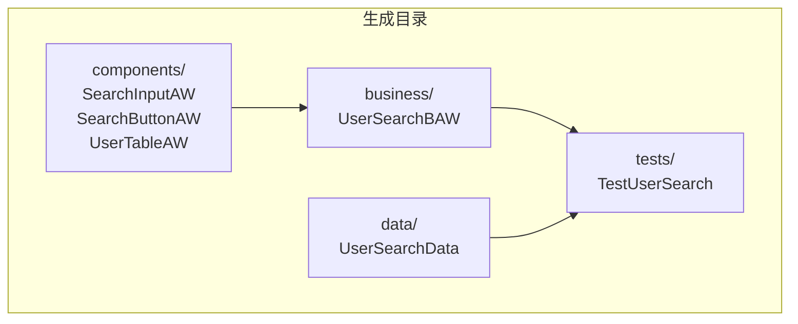
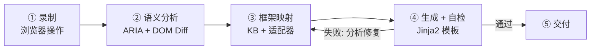
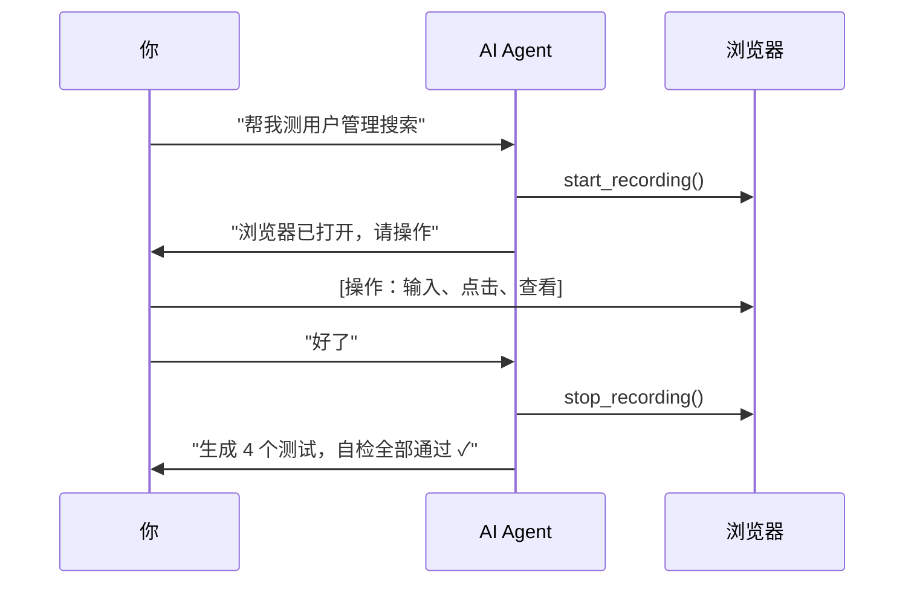

# uibridge

**给你的企业 UI 自动化框架装上 AI 接口。**

不改架构、不换框架、不重构。AI Agent 学习你团队的 TableAW、@FindBy、UserBuilder — 生成的测试与手写风格高度一致。


---

## 四大核心价值

| 价值 | 说明 |
|------|------|
| **框架知识库** | 自动扫描源码建立，自检反馈持续演化。NL 纠错永久生效。YAML 存储、可 commit |
| **零操作接入 AI** | 复制 3 个文件 + 改 1 行配置 → 启动 Agent 即用。AI 自动注册 9 个工具 |
| **交互录制 → 分层代码** | 你在浏览器操作，AI 录着。生成 ComponentAW → BusinessAW → TestScript + TestData 四层结构 |
| **零侵入 + 最低成本** | 不碰现有代码，已有测试继续跑。卸载: `uibridge cleanup --yes && pip uninstall uibridge -y` |

---

## 代码分层（为什么你的 50 个测试不会退化）



一个元素的 XPath 改了 → 只改对应 ComponentAW。50 个测试脚本不受影响。

---

## Pipeline



---

## 支持的框架

| 适配器 | 语言 | 测试框架 | 风格 |
|--------|------|---------|------|
| `reference` | Python | pytest | ComponentAW → BusinessAW → TestScript |
| `screenplay` | Python | pytest | Screenplay Pattern (Actor/Task/Question) |
| `java_testng` | Java | TestNG + Maven | Page Object + WebDriver + Assert (自动检测 JUnit 5) |
| `java_fluent` | Java | TestNG + Maven | Fluent API + PageFactory + AssertJ |

不在表中？AI Agent 自主分析项目并完成适配器开发，无需你写代码。详见 [适配器开发指南](docs/adapter-guide.md)。

---

## 快速开始

```bash
# 1. 安装
git clone https://github.com/timgunnar/UIBridge.git && cd uibridge
pip install -e .
playwright install chromium

# 2. 验证
uibridge --help
python -m pytest tests/ -v   # 135 个测试，覆盖核心引擎/适配器/代码生成/E2E

# 3. 卸载
uibridge cleanup --yes    # 清理项目中所有生成文件
pip uninstall uibridge -y # 卸载 Python 包
```

### 接入你的企业项目（3 步）

```bash
# 从工具目录复制 3 个种子文件到你的项目
mkdir -p /path/to/your-project/.uibridge
cp templates/CLAUDE.md    /path/to/your-project/
cp templates/.mcp.json    /path/to/your-project/
cp templates/adapter.yaml /path/to/your-project/.uibridge/

# 编辑 .uibridge/adapter.yaml → 改 base_package 为你的包名
# 启动 Agent
cd /path/to/your-project && claude
```

Agent 自动检测框架 → 扫描源码播种知识库 → 报告"发现 X 个组件、Y 个页面，就绪"。

---

## 工作流



---

## 文档

| 文档 | 读者 | 内容 |
|------|------|------|
| [用户手册](docs/user-guide.md) | 所有用户 | 安装、接入、日常使用、卸载 |
| [价值定位](docs/positioning.md) | 决策者 | 核心价值、方案对比、适用边界 |
| [录制指南](docs/recording-guide.md) | QA 工程师 | 录制交互、代码审查、反馈闭环 |
| [适配器开发指南](docs/adapter-guide.md) | Agent / 框架维护者 | 自定义适配器开发 4 阶段 |
| [知识库维护指南](docs/kb-maintenance-guide.md) | QA 团队负责人 | KB 查看、编辑、播种、版本控制 |
| [大模型自对接指南](docs/llm-integration-guide.md) | 平台工程师 | MCP/CLI/Skill 三种对接方式 |

