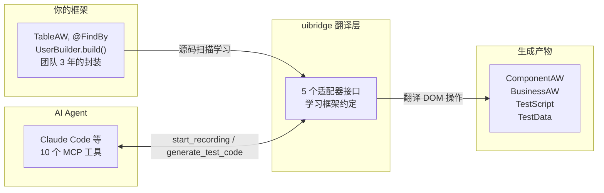
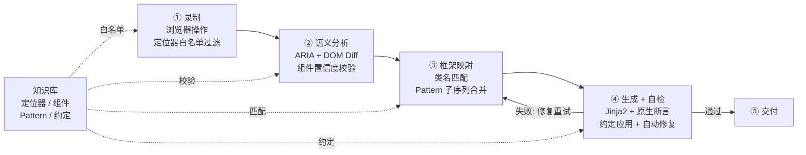
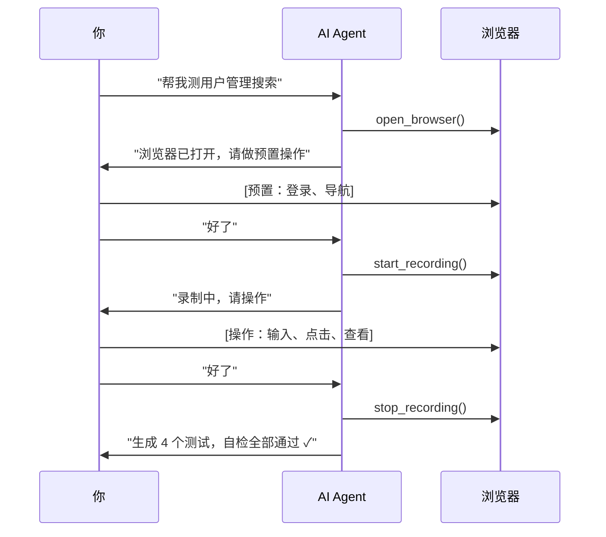

# uibridge

**给你的企业 UI 自动化框架装上 AI 接口。**

不改架构、不换框架、不重构。AI Agent 学习你团队的 TableAW、@FindBy、UserBuilder — 生成的测试与手写风格高度一致。



---

## 四大核心价值

| 价值 | 说明 |
|------|------|
| **框架知识库** | 两阶段建立：先画像后聚合，15000+ 文件过滤为 ~50-200 条精准知识。画像通过 NL 对话增强（"我们的基类是 X"）。自检反馈持续演化。YAML 存储、可 commit |
| **交互录制 → 分层代码** | 你在浏览器操作，AI 录制。内置多层噪声过滤（JS 防抖 + KB 白名单 + Pattern 匹配），生成 ComponentAW → BusinessAW → TestScript + TestData 四层结构，断言为框架原生风格 |
| **零侵入 + 最低成本** | 不碰现有代码，已有测试继续跑。卸载: `uibridge cleanup --yes && pip uninstall uibridge -y` |
| **全自动感知，对话式驱动** | 复制 3 个文件 → 启动 Agent。后续一切自动：自动检测框架、自动扫描源码推断包名和目录、自动播种知识库、自动注册 10 个工具。无需了解 uibridge 内部机制，通过自然语言对话即可使用和维护知识库 |

---

## 知识库 — 越用越准

一次性生成方案的 prompt 每次重写，知识随会话消失。uibridge 的 KB 是持久化资产：

| 机制 | 说明 |
|------|------|
| **两阶段过滤** | Phase 1 建立框架画像（UI 包路径 / 基类映射 / 定位器优先级）→ Phase 2 只扫描 UI 目录按组件族聚合。15000+ 源码文件过滤为 ~50-200 条精准知识 |
| **画像持续增强** | 框架画像通过 NL 对话更新（"我们的基类是 X"）、文档理解增强（"这是我们团队的编码规范.md"），字段级来源追踪和置信度。profile.yaml 可 commit 团队共享 |
| **NL 对话维护** | "定位器用 data-testid" → Agent 解析意图 → 更新 KB → 后续全部生效 |
| **置信度演化** | 自检通过 +0.02，失败 -0.25，长期不用衰减。高置信度采纳，低置信度归档 |
| **自动模式挖掘** | 每次生成后分析操作序列，发现频繁 BAW 模式写入 KB，下次直接复用 |
| **团队共享** | `.uibridge/kb/` 下 YAML 文件，可读可改可 commit |

---

## 框架画像 — 项目结构感知

首次接入时 uibridge 自动推断项目的宏观结构，生成 `.uibridge/profile.yaml`。画像是代码生成的决策源 — 知道往哪生成、按什么风格生成。

| 画像字段 | 自动推断内容 | 示例 |
|----------|-------------|------|
| `ui_packages` | UI 组件所在的包路径 | `com.acme.pages`, `com.acme.components` |
| `base_classes` | 继承体系中的基类 | `BasePage`, `BaseComponent` |
| `layer_structure` | 项目代码分几层、哪些由 uibridge 生成 | test 层 + data 层 (auto)，page 层 (user) |
| `locator_priorities` | 定位器优先级 | `data-testid > id > css` |
| `naming_conventions` | 方法/类命名规则 | `click_*`, `verify_*`, `*Page`, `*AW` |
| `output_config` | 生成文件的类型和输出目录 | `tests/` → test_script, `data/` → test_data |

**画像增强方式：**

```
你：我们的页面基类是 AbstractPageObject，不是 BasePage
AI：已更新 base_classes（confidence: 0.95，来源: human_dialogue）

你：[上传] 团队编码规范.md
AI：从文档识别到 3 条约定，已更新 naming_conventions 和 locator_priorities
```

**画像与知识库的关系**：画像定义"项目长什么样"（包路径、分层、约定），知识库存储"组件怎么用"（方法签名、定位器映射、操作模式）。画像在 Phase 1 建立，指导 KB 在 Phase 2 只扫描对的目录、按对的粒度聚合。

画像存储为 `.uibridge/profile.yaml`，支持 commit 后团队共享。详见 [框架画像维护指南](docs/profile-maintenance-guide.md)。

---

## 架构

| 层 | 核心文件 | 职责 |
|---|---|---|
| **Profile** | `profile.py`, `profile_store.py`, `profile_manager.py` | 框架画像：项目宏观结构（包路径、基类、分层约定），独立于 KB，运行时唯一决策源 |
| **KB** | `kb/store.py`（倒排索引）, `kb/item.py`, `kb/extractor/`（mixin 子包）, `kb/source_detection.py`, `kb/evolution.py`, `kb/freshness.py` | 组件模式聚合与知识管理 |
| **Pipeline** | `pipeline/`（编排器 + 4 个 stage） | 流程编排：录制→语义分析→框架映射→代码生成+自检 |
| **Discovery** | `discovery.py` | 组件与 BAW 模式发现，与 Pipeline 解耦 |
| **Adapter + Generator** | `adapter/`（5 个适配器）, `generator/`（4 个生成器） | 框架原生风格代码生成 |

---

## Pipeline



知识库贯穿全部四个阶段 — 不是一次性 prompt，是持续积累的团队资产。

---

## 一次录制，分层产出

你在浏览器操作业务，AI 录着。生成的不是线性脚本，是跟你项目一样的多层结构：


包名从你的 `pom.xml` 学的，类名从你的 `pages/*.java` 学的，断言风格从你的测试里学的。删掉重来也简单：`uibridge cleanup --yes`。

---

## 工作流



---

## 支持的框架

| 适配器 | 语言 | 测试框架 | 风格 |
|--------|------|---------|------|
| `reference` | Python | pytest | ComponentAW → BusinessAW → TestScript |
| `screenplay` | Python | pytest | Screenplay Pattern (Actor/Task/Question) |
| `java_testng` | Java | TestNG + Maven | Page Object + WebDriver + Assert (自动检测 JUnit 5) |
| `java_fluent` | Java | TestNG + Maven | Fluent API + PageFactory + AssertJ |
| `custom_playwright_java` | Java | TestNG + Maven | Playwright + Page Object + AssertJ |

不在表中？AI Agent 自主分析项目并完成适配器开发，无需你写代码。详见 [适配器开发指南](docs/adapter-guide.md)。

---

## 快速开始

### 安装

```bash
git clone https://github.com/timgunnar/UIBridge.git && cd uibridge
pip install -e .
playwright install chromium

# 验证
uibridge --help
python -m pytest tests/ -v   # 297 个测试，覆盖核心引擎/适配器/代码生成/E2E

# 卸载
uibridge cleanup --yes    # 清理所有生成文件 + 系统残留
pip uninstall uibridge -y # 卸载 Python 包
```

### 接入

```bash
# 从工具目录复制 3 个种子文件到你的项目
mkdir -p /path/to/your-project/.uibridge
cp templates/CLAUDE.md    /path/to/your-project/
cp templates/.mcp.json    /path/to/your-project/
cp templates/adapter.yaml /path/to/your-project/.uibridge/

# 启动 Agent。base_package 等配置由 uibridge 首次调用工具时自动扫描推断，无需手动设置
cd /path/to/your-project && claude
```

Agent 自动检测框架 → Phase 1 生成框架画像 → Phase 2 聚合播种知识库 → 报告"发现 X 个组件族、Y 个页面、Z 个约定，就绪"。

### 框架画像

首次启动时 Agent 自动调用 `seed_knowledge_base`，Phase 1 扫描项目结构并生成画像：

```
AI：检测到 Maven 项目，ui 包路径 com.acme.pages，基类 BasePage
    代码分层：pages/(用户维护) + tests/(自动生成) + data/(自动生成)
    定位器优先级：data-testid > id > css
    画像已写入 .uibridge/profile.yaml (confidence: 0.65)

    有需要修正的吗？
你：我们的基类是 AbstractPageObject，不是 BasePage
AI：已更新 base_classes → AbstractPageObject (confidence: 0.95)
```

画像字段不确定时 Agent 会主动确认。首次画像建立后可随时通过 NL 对话增强。

### 知识库建立

Phase 1 画像建立后自动进入 Phase 2 — 按画像指定的 UI 目录聚合提取知识：

```
AI：Phase 2 聚合提取中...
    扫描 com.acme.pages/ → 发现 12 个组件族
    扫描 com.acme.components/ → 发现 8 个组件封装
    提取方法签名 156 条、定位器映射 89 条、操作模式 23 条
    知识库播种完成，写入 .uibridge/kb/ (43 条 YAML)

    可开始录制测试。
```

知识库建立后即可使用 `start_recording` 录制测试。KB 会随使用持续演化 — 自检通过的知识 confidence 上升，失败的下降。

---

## 文档

| 文档 | 适用场景 | 读者 |
|------|---------|------|
| [用户手册](docs/user-guide.md) | 安装、接入、日常使用、卸载 | 所有用户 |
| [价值定位](docs/positioning.md) | 核心价值、方案对比、适用边界 | 决策者 |
| [录制指南](docs/recording-guide.md) | 录制交互、代码审查、反馈闭环 | QA 工程师 |
| [适配器开发指南](docs/adapter-guide.md) | 自定义适配器开发 4 阶段 | Agent / 框架维护者 |
| [知识库维护指南](docs/kb-maintenance-guide.md) | KB 查看、编辑、播种、版本控制 | QA 团队负责人 |
| [框架画像维护指南](docs/profile-maintenance-guide.md) | 画像理解、NL 增强、文档演化 | QA 团队负责人 |
| [MCP 工具参考](docs/mcp-tools.md) | 10 个 MCP 工具的功能与参数 | Agent 开发者 |
| [大模型自对接指南](docs/llm-integration-guide.md) | MCP/CLI/Skill 对接方式 | 平台工程师 |
