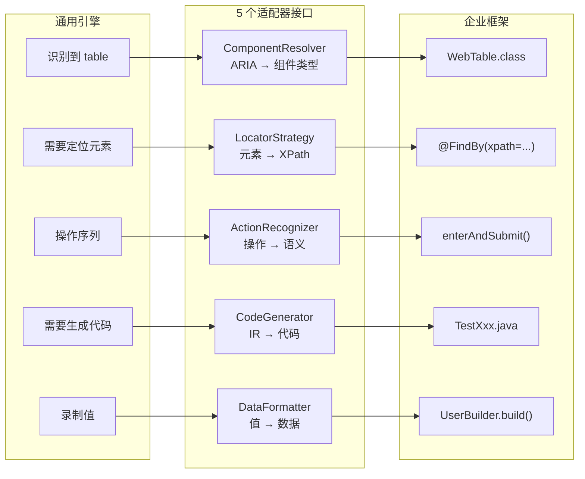
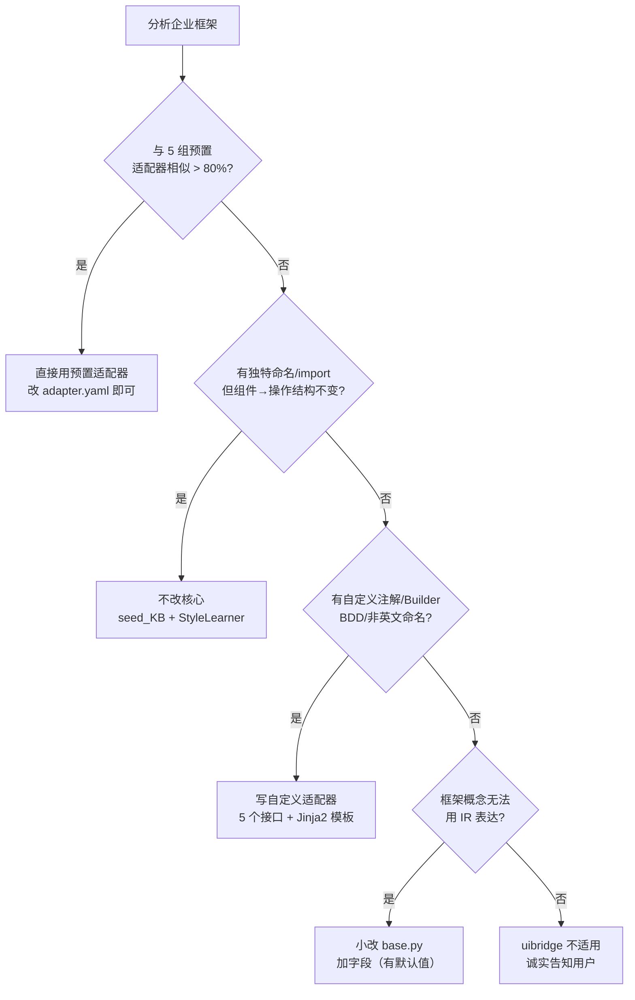

# Adapter 开发指南 — AI Agent 自主开发适配器的完整流程

当 5 组预置适配器都不匹配企业自研框架时，Agent 遵循本指南：分析项目 → 映射接口 → 生成代码。

## 适配器是什么

适配器 = 5 个 Python 类的组合，每个类实现一个接口。通用引擎通过这 5 个接口与企业的具体框架对话。



## Agent 工作流：从零生成适配器

### Phase 1: 分析企业项目（利用 Agent 可读文件的优势）

Agent 读取企业项目的关键文件，提取框架特征。**以下路径根据构建工具和语言选择对应的一组**：

```
1. 读取构建文件 → 确定语言和测试框架
   Java:  pom.xml / build.gradle / build.gradle.kts
   Python: pyproject.toml / setup.cfg / setup.py
   → 从中提取: 语言、测试框架依赖、构建工具

2. 读取页面对象 → 确定组件类型和定位策略
   Java Maven:  src/main/java/**/pages/*.java
   Java Gradle: src/main/java/**/pages/*.java
   Python:      src/**/pages/*.py  或  pages/*.py  或  page_objects/*.py
   → 有哪些类？类名模式？（XxxPage vs XxxPO vs XxxScreen）
   → 定位器怎么写？(@FindBy vs By.id vs data-test)
   → 方法怎么命名？(clickAdd vs addButton vs addBtn)

3. 读取测试文件 → 确定断言风格、测试结构
   Java:  src/test/java/**/tests/*.java (或 features/ 或 specs/)
   Python: tests/**/test_*.py  或  tests/**/*_test.py  或  features/*.py
   → 类名模式？（TestXxx vs XxxTest vs ShouldXxx）
   → 断言用哪个库？（Assert.assertEquals vs assertThat vs Assertions.assert*）
   → setUp/tearDown 怎么写？（@BeforeMethod/@BeforeClass/@BeforeEach）
   → import 了哪些包？

4. 读取数据文件 → 确定测试数据格式
   Java:  src/test/java/**/data/*.java  或  **/factories/*.java
   Python: tests/**/data/*.py  或  factories/*.py  或  test_data/*.py
   → 常量类？Builder 模式？JSON/YAML 文件？Factory 类？

5. 读取已有组件类 → 确定组件类型映射
   Java:  src/main/java/**/components/*.java (或其他命名如 widgets/ 或 aw/)
   Python: src/**/components/*.py  或  aaw/*.py  或  aw/*.py
   → 组件类名模式？（WebTable vs TableWidget vs TableComponent）
   → 每个组件有什么方法？（filterByColumn, clickRow, getRowCount...）
```

### Phase 2: 按 5 个接口逐一映射

根据 Phase 1 的分析结果，逐步实现：

#### 接口 1: ComponentResolver

```python
class CustomComponentResolver(ComponentResolver):
    """ARIA role / DOM 元素 → 企业框架的组件类名"""

    def resolve_type(self, aria_role: str, dom_attrs: dict, snapshot_context: str) -> str:
        # 从 Phase 1.2 和 1.5 的发现中建立映射
        # 例: 企业代码中有 WebTable → table → "WebTable"
        # 例: 企业代码中有 SearchBox extends WebInput → searchbox → "SearchBox"
        pass

    def suggest_name(self, url: str, aria_role: str, dom_attrs: dict) -> str:
        # 从 Phase 1.2 的页面对象命名推断组件实例名
        pass

    def get_methods_for_role(self, component_type: str, aria_role: str) -> list:
        # 从 Phase 1.5 的组件类方法中推断
        # 读取组件 .java 文件的 public 方法
        pass
```

**Agent 操作**：
- 扫描 `src/main/java/**/components/` 或 `src/main/java/**/pages/` 下的 `.java` 文件
- 提取每个类的 public 方法签名
- 建立 `{aria_role: java_class_name}` 映射表

#### 接口 2: LocatorStrategy

```python
class CustomLocatorStrategy(LocatorStrategy):
    """生成企业框架使用的选择器"""

    def build_xpath(self, element_info, dom_context) -> str:
        # 从 Phase 1.2 的定位器写法中推断优先级
        pass

    def extract_feature_point(self, xpath: str) -> dict:
        pass

    def get_locator_priority(self) -> list[str]:
        # 从企业代码中统计定位器使用频率
        pass
```

**Agent 操作**：
- 统计 `@FindBy`、`By.`、`driver.findElement` 等定位模式的使用频率
- `data-test` 出现最多 → 优先级第一
- `@FindBy(xpath = "...")` 出现最多 → xpath 第一
- 读取 `uibridge/adapter/base.py` 了解接口定义（5 个 ABC 类 + 共享数据结构）

#### 接口 3: ActionRecognizer

```python
class CustomActionRecognizer(ActionRecognizer):
    """DOM 操作 → 企业框架的业务语义动作"""

    def aggregate(self, raw_steps, page_context) -> list:
        # 从 Phase 1.3 的测试方法名推断业务动作命名
        pass

    def recognize_pattern(self, sequences) -> list[dict]:
        pass
```

**Agent 操作**：
- 读取测试方法名，寻找动词模式：`should*` / `test*` / `verify*`
- 读取页面对象的方法名，寻找动作模式：`clickXxx` / `enterXxx` / `selectXxx`

#### 接口 4: CodeGenerator — 最关键

```python
class CustomCodeGenerator(CodeGenerator):
    """按企业代码风格生成 Java/Python 测试代码"""

    def generate_component_aw(self, comp_def) -> str:
        # 从 Phase 1.5 的组件类中提取模板
        pass

    def generate_business_aw(self, baw_def) -> str:
        pass

    def generate_test_script(self, script_def) -> str:
        # 从 Phase 1.3 的已有测试中学习代码风格
        pass

    def generate_test_data(self, data_def) -> str:
        # 从 Phase 1.4 的数据文件中学习格式
        pass

    def get_import_style(self):
        # 从已有测试的 import 语句中提取
        pass

    def get_assertion_style(self):
        # 从已有测试的断言调用中提取
        pass
```

**Agent 操作（最关键步骤）**：
- 选择 1-2 个已有测试文件作为 Jinja2 模板的"原型"
- 将原型中的具体值替换为 Jinja2 变量 `{{ variable_name }}`
- 模板变量来自 `ScriptDef` / `TestDataDef` 等 IR 数据结构
- 参考 `uibridge/adapter/java_testng.py` 中的模板写法
- 测试框架自动检测：扫描源码中的 `org.junit.jupiter` → JUnit 5，否则 TestNG

#### 接口 5: DataFormatter

```python
class CustomDataFormatter(DataFormatter):
    """录制值 → 企业测试数据格式"""

    def format(self, captured_values, data_context) -> TestDataDef:
        # 从 Phase 1.4 的数据类中学习格式
        pass

    def get_data_ref_style(self, domain):
        pass
```

**Agent 操作**：
- 如果企业用 `UserBuilder.withName("张三").build()` → Builder 模式模板
- 如果企业用 `public static final String VALID_USER = "..."` → 常量模板
- 如果企业用 JSON 文件 → JSON 模板

### Phase 3: 生成适配器文件

将 5 个类的实现写入一个新文件：

```bash
# 文件位置
uibridge/adapter/custom_<project_name>.py
```

同时生成 `tests/test_custom_<project_name>.py` 验证适配器可用。

### Phase 4: 验证

```bash
python -m pytest tests/test_custom_<project_name>.py -v
```

### Phase 5: 注册适配器（关键步骤）

验证通过后，必须更新企业项目的 `.uibridge/adapter.yaml` 才能激活新适配器。

**adapter.yaml 格式**（位于企业项目根目录的 `.uibridge/adapter.yaml`）：

```yaml
adapter:
  name: "custom-my-project"
  version: "1.0"

  # ── 5 个适配器接口实现 ──
  # 每个 key 对应一个接口，value 为 "module.path.ClassName"
  components:
    resolver: "uibridge.adapter.custom_myproject.MyComponentResolver"
    locator: "uibridge.adapter.custom_myproject.MyLocatorStrategy"
    recognizer: "uibridge.adapter.custom_myproject.MyActionRecognizer"
    generator: "uibridge.adapter.custom_myproject.MyCodeGenerator"
    data_formatter: "uibridge.adapter.custom_myproject.MyDataFormatter"

  # ── 输出目录（相对于项目根目录）──
  paths:
    component_aw_dir: "src/main/java/{{ base_package }}/components/"
    page_dir: "src/main/java/{{ base_package }}/pages/"
    test_dir: "src/test/java/{{ base_package }}/tests/"
    test_data_dir: "src/test/java/{{ base_package }}/data/"

project:
  language: java          # java 或 python
  test_framework: testng  # testng / junit / pytest / ...
  build_tool: maven       # maven / gradle / pip
  base_package: com.enterprise
```

**5 个 key 与接口的对应关系**（不可改名）：

| key | 对应接口 | 说明 |
|-----|---------|------|
| `resolver` | `ComponentResolver` | ARIA role → 组件类型 |
| `locator` | `LocatorStrategy` | 元素 → XPath/选择器 |
| `recognizer` | `ActionRecognizer` | DOM 操作 → 业务语义 |
| `generator` | `CodeGenerator` | IR → 代码文件 |
| `data_formatter` | `DataFormatter` | 录制值 → 测试数据 |

**注册后验证**：

```bash
# 确认 adapter.yaml 被正确读取
python -c "
from uibridge.cli import load_adapter
resolver, locator, recognizer, generator, data_formatter = load_adapter('.uibridge/adapter.yaml')
print(resolver.__class__.__name__)
"
```

---

## 已有适配器参考

Agent 可以读取以下文件了解每个接口的具体实现方式：

| 文件 | 风格 | 参考维度 |
|------|------|---------|
| `uibridge/adapter/reference.py` | Python + ComponentAW | Python 代码生成、pytest fixture |
| `uibridge/adapter/screenplay.py` | Python + Screenplay | 抽象组件类型 (Target)、Actor 模式 |
| `uibridge/adapter/java_testng.py` | Java + Page Object | Java 代码生成、TestNG 注解、组件类 |
| `uibridge/adapter/java_fluent.py` | Java + Fluent | 链式调用、Builder 模式、AssertJ |
| `uibridge/adapter/custom_playwright_java.py` | Java + Playwright | Playwright API、AssertJ |

## 接口定义

完整接口定义在 `uibridge/adapter/base.py`，Agent 必须参考：

```
ComponentResolver:  resolve_type / suggest_name / get_methods_for_role
LocatorStrategy:    build_xpath / extract_feature_point / get_locator_priority
ActionRecognizer:   aggregate / recognize_pattern
CodeGenerator:      generate_component_aw / generate_business_aw / generate_test_script / generate_test_data / get_import_style / get_assertion_style
DataFormatter:      format / get_data_ref_style
```

## 关键数据结构

适配器的输入输出数据类定义在 `uibridge/adapter/base.py`：

- `MethodTemplate` — 方法模板 (name, params, body, return_type)
- `ComponentDef` — 组件定义 (class_name, base_class, methods)
- `ScriptDef` — 脚本定义 (class_name, test_name, imports, fixtures, steps)
- `TestDataDef` — 测试数据定义 (class_name, fields, file_path)
- `ImportStyle` / `AssertionStyle` — 代码风格描述
- `ElementInfo` — 元素信息 (tag, aria_role, selectors, attributes)

---

## 复杂封装应对指南：什么时候改什么

企业框架的封装复杂程度差异很大。Agent 在分析完企业项目后，按照以下决策树判断需要改什么：



**核心原则**：5 个适配器接口拿到的是原始数据 + 完全自由的 Jinja2 模板。引擎只生产数据（如 `ScriptDef`），适配器决定怎么变成代码。只要企业框架的抽象能用现有 IR 数据结构表达，就不需要改核心。

### 常见复杂模式与适配器对策

以下是企业项目中高频出现的复杂封装模式，以及**不改核心就能应对**的方法：

**1. 自定义注解定位（非 @FindBy）**

```java
// 企业代码
@Element(module = "user-table", strategy = WaitStrategy.VISIBLE)
private WebTable userTable;
```

对策：`LocatorStrategy.build_xpath()` 已经拿到 `dom_attrs`（包含 data-module 等属性），从 dom_attrs 中提取即可。定位优先级在 `get_locator_priority()` 中调整。

**2. 组件工厂 / Builder 模式**

```java
// 企业代码（不是 new WebTable()）
WebTable table = ComponentFactory.create("user-table")
    .withTimeout(30).withRetry(3).build();
```

对策：`CodeGenerator` 的 Jinja2 模板写工厂调用而非构造函数。`ComponentDef` 的 `base_class` 字段可复用为工厂类名。

```jinja2
{# 模板中做分支 #}

{{ comp_def.base_class }}.create("{{ comp_def.xpath }}")

new {{ comp_def.class_name }}(driver, "{{ comp_def.xpath }}")

```

**3. 等待 / 重试包装**

```java
// 企业代码：每个操作都包裹了等待/重试
waiter.waitFor(Condition.VISIBLE, 30).perform(() -> table.clickRow(0));
```

对策：在 CodeGenerator 模板的方法体中统一包裹等待逻辑。生成的是带等待的代码，不是裸调用。

**4. 泛型继承**

```java
// 企业代码
public class CrudPage<T extends Entity> extends BasePage<T> { ... }
public class UserPage extends CrudPage<UserEntity> { ... }
```

对策：`StyleLearner._analyze_java()` 已提取 `extends_class`。模板根据 extends 链生成对应的 import 和类声明。泛型参数可在模板中写死或从 KB 的命名约定推断。

**5. 非英文命名**

```python
# 企业代码
class 用户管理页面(BasePage):
    搜索输入框 = InputAW("//*[@data-test='search']")
```

对策：`StyleLearner` 的方法前缀检测基于正则 `test*`，但这是内部实现细节。生成器的模板变量来自 `ScriptDef`（数据），命名规则由 `ComponentResolver.suggest_name()` 控制。如果企业用中文命名，适配器的 `suggest_name()` 返回中文即可。

**6. BDD / Cucumber 层**

```gherkin
Given 管理员已登录
When  管理员搜索 "张三"
Then  表格显示 "张三" 的记录
```

对策：`CodeGenerator.generate_test_script()` 不输出测试类，而是输出 `.feature` 文件 + step definition 类。`ActionRecognizer.recognize_pattern()` 挖掘的是操作序列模式，可映射到 Given/When/Then 结构。BDD 完全是模板层面的切换，不涉及核心引擎。

### 需要扩展 IR 数据结构的信号

以下情况表明现有 IR 数据结构无法表达企业框架的某些概念，需要扩展。这些是**小改**（加字段、加枚举值），不是大改架构。

涉及两个文件，各管各的数据结构：

| 文件 | 管理的数据结构 | 职责 |
|------|-------------|------|
| `uibridge/engine/ir/framework_call.py` | `StepKind` / `MethodCall` / `FrameworkStep` / `Decl` / `TestCaseIR` | 步骤类型、方法调用、执行流程 |
| `uibridge/adapter/base.py` | `ComponentDef` / `ScriptDef` / `TestDataDef` / `PageDef` / `ElementInfo` 等 | 组件/页面/脚本/数据的定义 |

按信号判断改哪个文件：

| 信号 | 改哪个文件 | 怎么改 | 示例 |
|------|----------|--------|------|
| 框架有当前 StepKind 不覆盖的步骤类型 | `engine/ir/framework_call.py` | 新增 StepKind 枚举值 | `TRANSACTION = "transaction"` |
| 方法调用需要额外属性（事务、权限、超时……） | `engine/ir/framework_call.py` | MethodCall 新增字段 | `transactional: bool = False` |
| 测试用例需要额外元信息 | `engine/ir/framework_call.py` | TestCaseIR 新增字段 | `data_provider: str = ""` |
| 组件定义需要额外信息（泛型参数、工厂类……） | `adapter/base.py` | ComponentDef 新增字段 | `generics: list[str]` |
| 测试数据有 DataProvider / 参数化绑定 | `adapter/base.py` | TestDataDef 新增字段 | `provider_method: str = ""` |
| 页面定义需要额外信息（布局、主题……） | `adapter/base.py` | PageDef 新增字段 | `layout: str = ""` |
| 元素信息需要额外维度（等待策略、重试次数……） | `adapter/base.py` | ElementInfo 新增字段 | `wait_strategy: str = ""` |

**扩展流程**：

1. 在对应文件中给 dataclass 加字段（**必须有默认值**，向后兼容）
2. 在自定义适配器的模板中使用新字段
3. 在 Pipeline 中填充新字段（通常来自 ActionRecognizer 或 KB）
4. 已有适配器和测试不受影响（新字段有默认值）

**扩展 ≠ 大改**。引擎的录制、ARIA 分析、DOM diff 逻辑完全不受影响。Pipeline 只是多传一个字段。

### 不适用 uibridge 的信号

以下信号意味着框架超出了 uibridge 的定位范围，应向用户诚实说明：

| 信号 | 原因 |
|------|------|
| 不是浏览器 UI（桌面应用 / 移动端 / 小程序） | Recorder 基于 Playwright，整个录制链路不适用 |
| 不是 UI 测试（API 测试 / 单元测试 / 性能测试） | uibridge 的定位是 UI 自动化框架知识翻译 |
| 框架没有组件抽象（裸 Selenium / 裸 Playwright） | 没有框架知识可翻译，生成的无结构代码与纯 AI 生成无异 |
| 框架是可视化低代码平台（拖拽生成测试） | 不写代码的测试平台不需要代码生成器 |
| 框架的代码生成规则是闭源的（商业工具内部格式） | 无法分析，也无法注入生成逻辑 |
