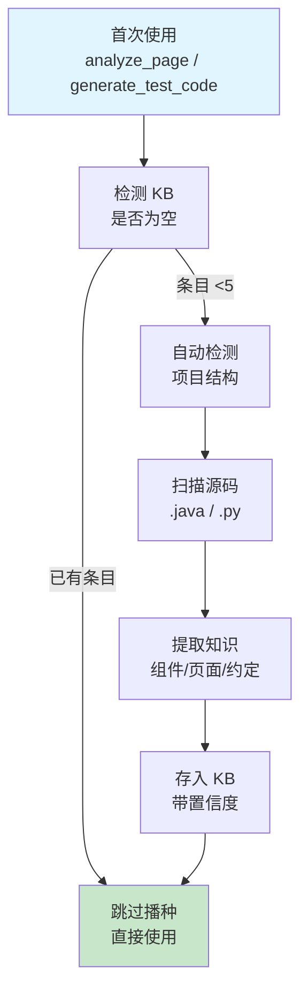
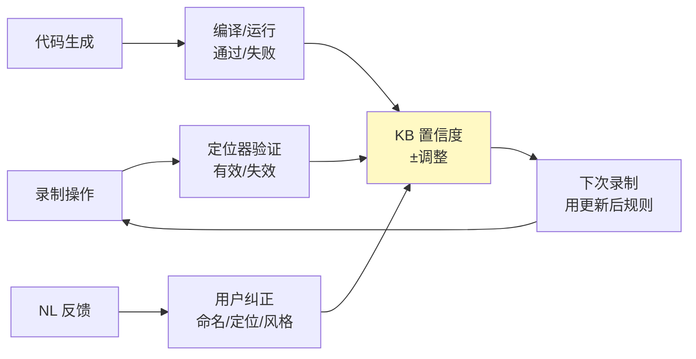

# 知识库维护指南

**知识库自动建立、NL 对话维护、持续演化。**

---

## 知识库是什么

知识库（KB）是 `.uibridge/kb/` 下的 YAML 文件集合，存储从项目源码自动提取的框架约定。**KB 决定了生成代码的包名、import、组件类名、定位器优先级和断言风格。**

```
.uibridge/kb/
├── components/     ← 组件类名、方法、定位器
├── conventions/    ← 命名约定、定位器优先级、import 风格
├── patterns/       ← 频繁操作序列模式
├── pages/          ← 页面构成信息
└── archive/        ← 低置信度归档条目
```

---

## KB 自动建立流程

KB 无需手动播种。首次使用 `analyze_page` / `generate_test_code` 时自动触发：



### 阶段 1：项目结构自动检测

根据项目构建文件自动识别目录布局，无需手动配置：

| 检测信号 | 识别为 | 扫描路径 |
|---------|--------|---------|
| `pom.xml` / `build.gradle` | Java 项目 | `src/main/java/`, `src/test/java/` + `pom.xml` 自定义目录 |
| `pyproject.toml` / `setup.py` | Python 项目 | `pages/`, `tests/`, `aw/` 等常见目录 |
| 无构建文件 | 通用项目 | 递归扫描 `src/` 下源码，反推目录结构 |

非标准 Maven 目录（如 `<sourceDirectory>src/my-java</sourceDirectory>`）通过读取 `pom.xml` 自动适配。无 `src/main/java` 的项目通过递归扫描 `.java` 文件位置反推实际目录。

### 阶段 2：源码扫描与提取

| 源文件 | 提取内容 | 初始置信度 |
|--------|---------|-----------|
| 页面对象 (`*Page.java`, `*AW.java`) | 类名、方法签名、定位器模式（XPath/CSS） | 0.6-0.8 |
| 测试脚本 (`*Test.java`) | 测试命名、断言风格、import 列表 | 0.6-0.8 |
| 组件封装 (`*AW.java`, `*Widget.java`) | 组件类型、方法、属性标识 | 0.7 |
| 设计文档 | 命名约定、架构说明 | 0.5 |

### 阶段 3：持续演化

KB 不是一次性产物，随项目使用持续自我优化：



---

## NL 对话维护 KB

KB 支持通过自然语言对话进行增删改查，无需理解 YAML 结构。

Agent 通过 `update_knowledge_base` MCP 工具实现 NL 意图解析，支持 ADD/MODIFY/DELETE/QUERY 四类操作。

### 查询

```
用户："项目定位器优先级是什么？"
Agent → query_knowledge_base → 返回 NL 摘要
```

### 修改

```
用户："表格组件应该用 data-testid 定位"
Agent → 意图识别(MODIFY) → 更新 KB → 确认
```

### 新增

```
用户："新增规则：弹窗用 role='dialog' 识别"
Agent → 意图识别(ADD) → 创建条目 → 确认
```

### 删除

```
用户："删掉那个表格排序的规则"
Agent → 搜索定位 → 预览 → 确认 → 软删除
```

### 反馈类型速查

| 你说的 | 意图 | KB 变化 | 影响范围 |
|--------|------|---------|---------|
| "定位器用 data-testid" | MODIFY | locator_priority 更新 | 所有生成代码的定位策略 |
| "断言用 AssertJ" | MODIFY | assert_style 更新 | 所有测试脚本的断言 |
| "类名用 XxxPage 不是 XxxAW" | MODIFY | naming_rules 更新 | 所有组件的命名 |
| "这个组件多了 getRowCount()" | ADD | 组件方法列表更新 | 该组件的 AW |
| "测试数据用 Builder" | MODIFY | data_format 更新 | 数据生成模板 |

---

## 置信度机制

每个 KB 条目有置信度 (0.0~1.0)，决定生成时是否被采纳：

| 范围 | 含义 | 生成时行为 |
|------|------|-----------|
| 0.8-1.0 | 高置信度 | 直接采纳 |
| 0.5-0.8 | 中置信度 | 采纳，标记 review_needed |
| 0.3-0.5 | 低置信度 | 不采纳，使用默认值 |
| <0.3 | 归档 | 自动移入 archive/ |

**置信度来源与变化**：

| 事件 | 变化 | 说明 |
|------|------|------|
| 源码提取 | 初始 0.6-0.8 | 静态分析可能有误 |
| 用户注入 | 初始 0.85-0.95 | 人工确认的高质量知识 |
| 自检通过 | +0.02/次 | 生成的代码编译/运行通过 |
| 自检失败 | -0.25/次 | 生成代码编译/运行失败 |
| 长时间未验证 | 逐步衰减 | 稳定知识不衰减，动态知识衰减快 |
| 多源交叉确认 | bonus +0.1~0.2 | 2+ 来源确认同一知识 |

---

## 手动编辑 KB

KB 是纯 YAML，可直接编辑：

```yaml
# .uibridge/kb/conventions/locator_priority.yaml
category: conventions
key: convention.locator_priority
value:
  priority:
    - data-testid      # 编辑：调整优先级顺序
    - data-module
    - id
confidence: 0.95
description: "用户确认 data-testid 为首选定位属性"
```

编辑后下次生成即刻生效。

---

## 版本控制

KB 是 YAML 文件，天然适合 Git 管理：

```bash
git add .uibridge/kb/
git commit -m "KB: 更新定位器优先级为 data-testid"
```

**建议**：将 `.uibridge/kb/` 和 `.uibridge/adapter.yaml` 纳入版本控制，团队共享 KB。

---

## 归档与清理

低置信度条目（<0.3 + 失败≥3次）自动移入 `archive/`，不参与生成。

```bash
# 预览归档
ls .uibridge/kb/archive/

# 完全重置 KB
rm -rf .uibridge/kb/
# 下次使用自动重新播种
```

---

## 常见问题

**Q: KB 条目太多会影响性能吗？**
A: 不会。高置信度条目通常 <50 个，YAML 解析极快。

**Q: 如何确认 KB 是否生效？**
A: 看生成的代码。如果 `package` 和 `import` 使用了你的实际包名（而非默认值），说明 KB 集成正常。

**Q: 新项目需要手动配置 KB 吗？**
A: 不需要。首次使用自动播种。冷启动时期生成的代码带有 `// TODO: verify` 注释，经过 3-5 次录制+纠正后精准度达到 85%+。

**Q: 非标准 Maven 目录结构能自动检测吗？**
A: 能。pom.xml 自定义目录、无标准 src/main/java 的非标布局、多模块项目均通过递归扫描自动适配。
