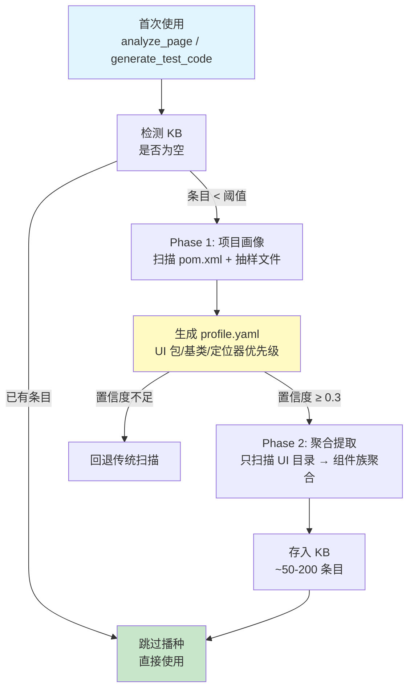
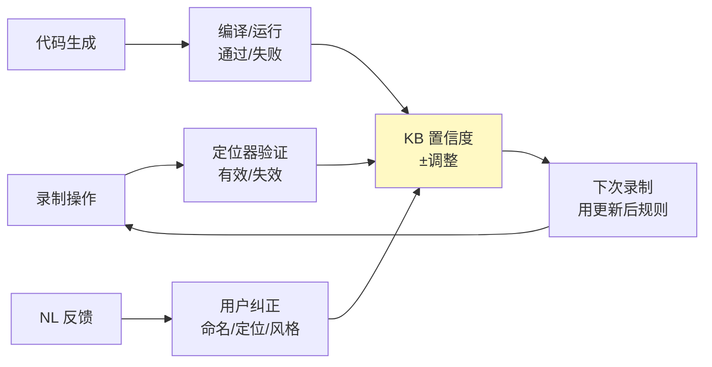

# 知识库维护指南

**知识库自动建立、NL 对话维护、持续演化。**

---

## 知识库是什么

知识库（KB）是 `.uibridge/kb/` 下的 YAML 文件集合，存储从项目源码自动提取的框架约定。**KB 决定了生成代码的包名、import、组件类名、定位器优先级和断言风格。**

KB 与**框架画像（Profile）**解耦为两个独立系统：

- **Profile（框架画像）**：存储在 `.uibridge/profile.yaml`，定义项目的宏观元数据。Profile 是以下信息的**权威来源**：`base_classes`、`locator_priorities`、`naming_conventions`、`source_dirs`、`layer_structure`。详见[框架画像维护指南](profile-maintenance-guide.md)。
- **KB**：存储在 `.uibridge/kb/{category}/*.yaml`，存储运行时发现的模式（组件方法、操作序列、页面构成等）。KB 的约定（conventions）仅存储 Profile 中**未覆盖**的运行时发现模式，不重复 Profile 中已有的信息。

KB 采用**两阶段建立**：Phase 1 先扫描项目建立框架画像，Phase 2 只扫描 UI 目录按组件族聚合提取，将 15000+ 个源码文件的噪声压缩为 ~50-200 条精准知识。

```
.uibridge/
├── profile.yaml       ← 框架画像（Phase 1 输出，独立于 KB 的运行时配置源）
└── kb/
    ├── components/    ← 组件族聚合条目（Phase 2 输出）
    ├── conventions/   ← runtime-discovered 约定（不重复 profile 已有项）
    ├── patterns/      ← 频繁操作序列模式
    ├── pages/         ← 页面构成信息
    ├── snapshots/     ← 组件快照（用于新鲜度监控）
    └── archive/       ← 低置信度归档条目
```

KB 内置**倒排索引**，对搜索词建立 token→item 映射，大部分查询命中小于 10ms，无需遍历全量 YAML 文件。

> **框架画像是什么？** 画像是项目的 UI 框架元数据快照，记录了哪些目录是 UI 代码、基类是什么、定位器优先级等。Phase 2 依据画像过滤掉 Model/Service/DTO 等非 UI 文件，只提取真正有意义的 UI 知识。画像通过 NL 对话和文档理解持续增强。

---

## KB 自动建立流程

KB 无需手动播种。首次使用 `analyze_page` / `generate_test_code` 时自动触发两阶段建立：



### 阶段 1：项目结构自动检测

根据项目构建文件自动识别目录布局，无需手动配置：

| 检测信号 | 识别为 | 扫描路径 |
|---------|--------|---------|
| `pom.xml` / `build.gradle` | Java 项目 | `src/main/java/`, `src/test/java/` + `pom.xml` 自定义目录 |
| `pyproject.toml` / `setup.py` | Python 项目 | `pages/`, `tests/`, `aw/` 等常见目录 |
| 无构建文件 | 通用项目 | 递归扫描 `src/` 下源码，反推目录结构 |

非标准 Maven 目录（如 `<sourceDirectory>src/my-java</sourceDirectory>`）通过读取 `pom.xml` 自动适配。无 `src/main/java` 的项目通过递归扫描 `.java` 文件位置反推实际目录。

### Phase 1：项目画像

| 分析步骤 | 内容 | 产出 |
|---------|------|------|
| 构建文件分析 | 读取 pom.xml / build.gradle | 项目类型、模块结构 |
| 源码抽样 | 抽取 50 个文件分析注解/基类/包名 | UI 包路径、基类映射 |
| 命名推断 | 从类名提取前缀/后缀模式 | 命名约定 |
| 定位器统计 | 统计各定位器属性的使用频率 | 定位器优先级 |

Phase 1 生成 `.uibridge/profile.yaml`（框架画像），不产生 KBItem。详见[框架画像维护指南](profile-maintenance-guide.md)。

### Phase 2：聚合提取

| 步骤 | 内容 | 产出数量 |
|------|------|---------|
| UI 文件过滤 | 仅保留画像 ui_packages 中指定的路径 | 从 15000+ → ~200 文件 |
| 组件族聚合 | 同类型组件（Table* → "table"）合并 | ~50-150 个聚合 KBItem |
| 页面索引 | 提取页面级知识 | ~10-30 个 |
| 约定批量生成 | 基于画像生成全局约定 | 3-8 个 |
| 模式挖掘 | 从测试文件提取 BAW 操作模式 | 5-20 个 |

### 阶段 3：持续演化

KB 不是一次性产物，随项目使用持续自我优化。演化逻辑由 `KBEvolution` 类统一管理，对用户透明：



**KBEvolution** 负责三个演化操作：

| 操作 | 触发条件 | 效果 |
|------|---------|------|
| 衰减 | 条目的 `decay_rate > 0`，随时间推移 | 未验证的动态知识置信度逐步降低 |
| 泛化 | 同一类别中出现 ≥3 个相似 value 结构的条目 | 合并模式，置信度各 +0.05，标记 `generalized` |
| 归档 | 置信度 <0.2 且自检失败 ≥3 次 | 条目移入 `archive/`，不再参与生成 |

**FreshnessMonitor** 负责组件新鲜度监控：对 Profile 中 `component_monitoring` 配置的组件，定期对比 KB 快照与源码。快照比较使用**结构化方法签名解析**——不仅检测方法的增删，还检测返回类型和参数列表的变化，生成精确的差异报告。开箱后自动激活，详见[框架画像维护指南](profile-maintenance-guide.md)中 `component_monitoring` 字段说明。

---

## NL 对话维护 KB

KB 支持通过自然语言对话进行增删改查，无需理解 YAML 结构。

Agent 通过 `update_knowledge_base` MCP 工具实现 NL 意图解析，支持 ADD/MODIFY/DELETE/QUERY 四类操作。

### 查询

```
用户："项目定位器优先级是什么？"
Agent → query_knowledge_base → 返回 NL 摘要
```

### 修改

```
用户："表格组件应该用 data-testid 定位"
Agent → 意图识别(MODIFY) → 更新 KB → 确认
```

### 新增

```
用户："新增规则：弹窗用 role='dialog' 识别"
Agent → 意图识别(ADD) → 创建条目 → 确认
```

### 删除

```
用户："删掉那个表格排序的规则"
Agent → 搜索定位 → 预览 → 确认 → 软删除
```

### 反馈类型速查

| 你说的 | 意图 | KB 变化 | 影响范围 |
|--------|------|---------|---------|
| "定位器用 data-testid" | MODIFY | locator_priority 更新 | 所有生成代码的定位策略 |
| "断言用 AssertJ" | MODIFY | assert_style 更新 | 所有测试脚本的断言 |
| "类名用 XxxPage 不是 XxxAW" | MODIFY | naming_rules 更新 | 所有组件的命名 |
| "这个组件多了 getRowCount()" | ADD | 组件方法列表更新 | 该组件的 AW |
| "测试数据用 Builder" | MODIFY | data_format 更新 | 数据生成模板 |

---

## KB 搜索机制

KB 查询采用**三级回退搜索**，平衡速度与召回率：

```
查询输入 → 倒排索引（<10ms） → 命中？ → 返回
                ↓ 未命中
           子串匹配 → 命中？ → 返回
                ↓ 未命中
           TF-IDF 关键词评分 → 返回 Top-N
```

| 层级 | 方法 | 特点 |
|------|------|------|
| L1 倒排索引 | 分词后查 token→item 映射表，按 token 命中数排序 | 毫秒级响应，处理大多数精确查询 |
| L2 子串匹配 | 遍历条目文本做大小写不敏感子串匹配 | 中等开销，处理索引未覆盖的模糊查询 |
| L3 TF-IDF 评分 | 对查询词计算 IDF 加权余弦相似度，结合置信度排序 | 较高开销但覆盖最广，处理语义级泛化查询 |

三层的综合得分公式：`combined = relevance x 0.5 + confidence x 0.5`，确保结果既相关又可靠。用户通过 `query_knowledge_base` MCP 工具或 Agent NL 对话触发查询时，以上搜索路径对用户完全透明。

---

## 置信度机制

每个 KB 条目有置信度 (0.0~1.0)，决定生成时是否被采纳：

| 范围 | 含义 | 生成时行为 |
|------|------|-----------|
| 0.8-1.0 | 高置信度 | 直接采纳 |
| 0.5-0.8 | 中置信度 | 采纳，标记 review_needed |
| 0.3-0.5 | 低置信度 | 不采纳，使用默认值 |
| <0.3 | 归档 | 自动移入 archive/ |

**置信度来源与变化**：

| 事件 | 变化 | 说明 |
|------|------|------|
| 源码提取 | 初始 0.6-0.8 | 静态分析可能有误 |
| 用户注入 | 初始 0.85-0.95 | 人工确认的高质量知识 |
| 自检通过 | +0.02/次 | 生成的代码编译/运行通过 |
| 自检失败 | -0.25/次 | 生成代码编译/运行失败 |
| 长时间未验证 | 逐步衰减 | 稳定知识不衰减，动态知识衰减快 |
| 多源交叉确认 | bonus +0.1~0.2 | 2+ 来源确认同一知识 |

---

## 手动编辑 KB

KB 是纯 YAML，可直接编辑：

```yaml
# .uibridge/kb/components/table.yaml
category: components
key: component.table.methods
value:
  methods:
    - sortColumn(String column, Direction dir)
    - getRowCount()
    - selectRow(int index)
  locators:
    data_testid: "result-table"
confidence: 0.85
description: "表格组件的已知方法和定位器"
```

> **注意**：`locator_priorities`、`base_classes`、`naming_conventions` 等全局元信息属于 Profile（`.uibridge/profile.yaml`），修改这些字段请编辑 Profile 或通过 NL 对话操作画像。KB conventions 仅存储 Profile 未覆盖的运行时发现模式。

编辑后下次生成即刻生效。

---

## 版本控制

KB 是 YAML 文件，天然适合 Git 管理：

```bash
git add .uibridge/profile.yaml .uibridge/kb/
git commit -m "KB: 更新定位器优先级为 data-testid"
```

**建议**：将 `.uibridge/profile.yaml`、`.uibridge/kb/` 和 `.uibridge/adapter.yaml` 纳入版本控制，团队共享画像和 KB。

---

## 归档与清理

低置信度条目（置信度 <0.2 且自检失败 ≥3 次）由 `KBEvolution` 自动移入 `archive/`，不参与生成。归档条件在 KBEvolution 中集中管理，用户无需手动维护。

```bash
# 预览归档
ls .uibridge/kb/archive/

# 完全重置 KB
rm -rf .uibridge/kb/
# 下次使用自动重新播种
```

---

## 常见问题

**Q: KB 条目太多会影响性能吗？**
A: 不会。高置信度条目通常 <50 个，YAML 解析极快。

**Q: 如何确认 KB 是否生效？**
A: 看生成的代码。如果 `package` 和 `import` 使用了你的实际包名（而非默认值），说明 KB 集成正常。

**Q: 新项目需要手动配置 KB 吗？**
A: 不需要。首次使用自动播种。冷启动时期生成的代码带有 `// TODO: verify` 注释，经过 3-5 次录制+纠正后精准度达到 85%+。

**Q: 非标准 Maven 目录结构能自动检测吗？**
A: 能。pom.xml 自定义目录、无标准 src/main/java 的非标布局、多模块项目均通过递归扫描自动适配。
