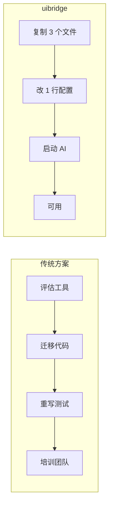
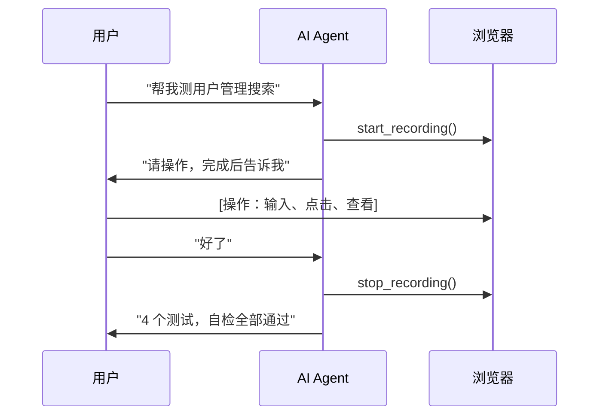

# uibridge 价值定位

**给你的企业 UI 自动化框架装上 AI 接口。**

不改架构、不换框架、不重构。uibridge 学习你的分层设计和代码约定，把浏览器操作翻译成符合团队风格的测试代码。

---

## 你已有的，我们不动

```
你已有的（不变）                     uibridge 新增的（AI 接口）
─────────────────                    ──────────────────────────
TableAW、@FindBy、UserBuilder        analyze_page() — 分析页面组件
200 个测试继续跑                      start_recording() — 交互式录制
pom.xml / pyproject.toml             generate_test_code() — 生成+自检
团队约定和代码风格                     seed_knowledge_base() — 学习约定
                                     query_knowledge_base() — 查询知识
```

**你的框架现在有了 AI 能调用的接口。不是替代，是增强。**

---

## 四大核心价值

### 1. 企业自有框架的知识库

```
源码扫描（自动）──→ KB 建立 ──→ 自检反馈（自动）──→ 置信度演化
                      ↑                              ↓
                      └── 用户纠错（自然语言）──── 持续迭代
```

| 能力 | 说明 |
|------|------|
| 自动建立 | 扫描 `pages/*.java` / `tests/*.java` → 提取类名、方法签名、XPath 模式、断言风格 |
| 持续维护 | 每次生成+自检 → 通过 +0.02 / 失败 -0.25。长期不用自动衰减 |
| NL 纠错 | "定位器应该用 data-testid" → 一句话修正，永久记住 |
| 版本控制 | YAML 文件存储在 `.uibridge/kb/`，可读可改可 commit |

**和一次性 prompt 的本质区别**：prompt 每次重新描述，人走了知识没了。KB 的 YAML 文件是团队资产，持续积累。

### 2. 零操作接入企业 AI



AI Agent 自动获得 8 个 MCP 工具，无需任何额外配置。

### 3. 交互录制 → 分层代码



**天生四层结构**（详见 DESIGN.md）：

```
生成代码遵循 ComponentAW → BusinessAW → TestScript + TestData 四层架构。
每层只关心自己的职责 —— 元素变了只改一层，测试不用动。
```

**为什么分层是关键**：NL 方案生成线性脚本，50 个测试后一个 DOM 改了要改 20 个文件。分层输出 → 一个元素改了只改 ComponentAW，50 个测试不受影响。

### 4. 零侵入，最低适配成本

| | NL 用例生成方案 | uibridge |
|------|-----------|----------|
| 对现有项目 | 另起炉灶：创建 NL 用例库，放弃已有测试 | 零侵入：现有测试继续跑 |
| 前期投入 | 写 200 条 NL 描述 + 调试生成质量 | 复制 3 个文件 + 改 1 行配置 |
| 退回成本 | 高（已投入的 NL 用例描述 + 迁移代码） | 零（删掉 `generated/` 即可） |
| 知识归属 | 在 LLM 模型权重里，无法控制 | 在 `.uibridge/kb/` YAML 文件里 |

**本质差异**：NL 方案是"让 AI 帮你写代码" — 每次 LLM 猜测你的框架。uibridge 是"给你的框架装上 AI 接口" — AI 学习你的约定，知识留在你的仓库。

---

## 方案对比

| 维度 | 纯手工 | 录制回放 | NL 生成 | **uibridge** |
|------|--------|---------|--------|----------|
| 怎么生成测试 | QA 手写代码 | 录制→回放/导出 | NL 描述→LLM 生成 | 录制→学习框架→生成 |
| 代码风格 | 团队约定 | **工具固定风格** | **LLM 随机风格** | **从源码学习，和手写一致** |
| 代码结构 | 取决于工程师 | 线性脚本 | 不稳定 | **天生四层** |
| 启动成本 | 高 | 低 | 中 | **极低（3 文件 + 1 行配置）** |
| 维护成本 | 中 | **高（线性退化快）** | **高（维护 NL 描述 + 生成代码双层）** | **低（分层代码，改动范围小）** |
| 生成稳定性 | ★★★ 确定 | ★★★ 确定 | ★★☆ 同一描述两次不同 | ★★★ 确定管道 + KB 约束 |
| API 准确度 | ★★★ 手写准确 | ★★★ 录制真实元素 | ★★☆ 可能编造类名 | ★★★ 源码学习 + 硬编码兜底，不编造 |
| 自检验证 | 开发者自己跑 | 部分 | ✗ | ★★★ 生成即自检 |

---

## 用户价值

| 角色 | 获得什么 |
|------|---------|
| QA 工程师 | 录制代替手写，专注业务流程而非代码细节 |
| QA 团队负责人 | 团队约定自动执行，新人上手零教学成本 |
| 框架维护者 | 框架知识资产化，人走了约定不丢 |
| 技术管理者 | 零风险尝试 AI，不绑架现有投资 |
