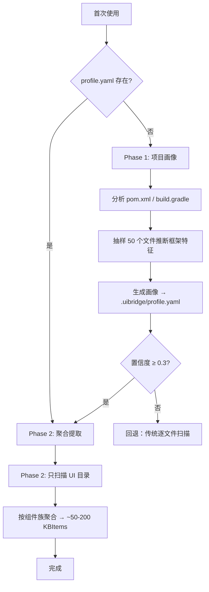

# 框架画像维护指南

**框架画像是知识库的前置过滤层 — 自动扫描项目建立，NL 对话持续增强。**

---

## 框架画像是什么

框架画像（`FrameworkProfile`）是项目的 UI 自动化框架元数据快照，存储在 `.uibridge/profile.yaml`。它是两阶段知识提取的 Phase 1 产物，独立于 KB 的运行时配置源。

```
源码扫描 → Phase 1: 框架画像（profile.yaml）
                    ↓
          Phase 2: 聚合提取（~50-200 KBItems）
```

**旧路径自动迁移**：若 `.uibridge/kb/profile.yaml` 存在且新路径无文件，首次加载时自动移动到 `.uibridge/profile.yaml`。

**代码模块**：画像相关代码位于三个独立模块中：

| 模块 | 职责 |
|------|------|
| `uibridge/profile.py` | `FrameworkProfile` + `ProfileField` 数据类定义 |
| `uibridge/profile_store.py` | `ProfileStore` — YAML 持久化，带 TTL 缓存（300s），自动迁移 |
| `uibridge/profile_manager.py` | `ProfileManager` — 画像生命周期管理（播种、确认、更新、文档增强） |

**向后兼容**：`from uibridge.kb import FrameworkProfile, ProfileField` 仍可用（re-export）。

**画像 vs KBItem 的关系**：

| | 框架画像 | KB 条目 |
|---|---|---|
| **定位** | 项目级的"地图" — 哪些目录是 UI 代码、基类是什么 | 框架知识的"条目" — 具体组件方法、页面结构 |
| **数量** | 1 个文件 | ~50-200 个条目 |
| **作用** | 过滤噪声 → 只有 UI 相关文件才提取为 KBItem | 驱动代码生成（包名、定位器、方法模板） |
| **维护** | NL 对话 + 文档理解 | NL 对话 + 自检反馈 |
| **文件** | `.uibridge/profile.yaml` | `.uibridge/kb/{category}/*.yaml` |

---

## 画像包含什么

每个字段有独立的**值**、**来源追踪**和**置信度**：

```yaml
# .uibridge/profile.yaml
project_type: java_maven
profiling_confidence: 0.72
version: 4
updated_by: human_dialogue
created_at: 1716562800.0

ui_packages:
  value:
    - com/acme/components
    - com/acme/pages
  source: auto
  confidence: 0.60
  description: "项目 UI 代码所在的 Java 包路径，Phase 2 只扫描这些路径"

base_classes:
  value:
    WebTable: table
    WebButton: button
    AbstractUIComponent: container
  source: human_dialogue
  confidence: 0.95
  description: "UI 基类到组件类型的映射，控制组件族分组"

annotations:
  value:
    - "@FindBy"
    - "@Test"
  source: auto
  confidence: 0.65
  description: "框架使用的注解，用于识别组件类和测试类"

locator_priorities:
  value:
    - data-testid
    - id
    - xpath
  source: document
  confidence: 0.85
  description: "定位器属性优先级，驱动所有代码生成的定位策略"

naming_conventions:
  value:
    prefix: Web
    suffix: Page
  source: auto
  confidence: 0.55
  description: "类名前缀/后缀约定，控制 AW/Page 类命名"

source_dirs:
  value:
    components: src/main/java/com/acme/components
    pages: src/main/java/com/acme/pages
    tests: src/test/java/com/acme/tests
  source: auto
  confidence: 0.65
  description: "各类代码所在目录，控制文件扫描范围"

layer_structure:
  value:
    - name: component_aw
      dir: components
      role: "UI 组件封装"
      enabled: false
      managed_by_user: true
      maps_to: ""
      description: "现有组件封装层，由用户维护，uibridge 不生成"
    - name: page
      dir: pages
      role: "页面对象"
      enabled: true
      managed_by_user: true
      maps_to: ""
      description: "页面对象层，由用户维护"
    - name: test
      dir: tests
      role: "测试脚本"
      enabled: true
      managed_by_user: false
      maps_to: "test_script"
      description: "录制后 uibridge 生成的测试脚本"
    - name: test_data
      dir: data
      role: "测试数据"
      enabled: true
      managed_by_user: false
      maps_to: "test_data"
      description: "录制后 uibridge 生成的测试数据"
  source: auto
  confidence: 0.60
  description: "项目代码分层结构。maps_to 关联 output_config 生成类型；managed_by_user=true 表示该层由用户维护"

reference_directories:
  value:
    mature: []
    developing: []
    deprecated: []
  source: auto
  confidence: 0.55
  description: "成熟目录代码作为框架权威参考，开发中目录仅作辅助，过时目录忽略"

output_config:
  value:
    generate:
      - type: test_script
        dir: tests
        template: default
      - type: test_data
        dir: data
        template: default
  source: auto
  confidence: 0.65
  description: "录制完成后自动生成的文件类型及输出位置。template 指定代码生成模板"

component_monitoring:
  value:
    enabled: false
    components: []
    check_interval_days: 7
  source: auto
  confidence: 0.50
  description: "组件过时检测。开启后定期对比 KB 中组件快照与源码，发现变更时告警"
```

### ProfileField 结构

每个画像字段（除 `project_type`、`profiling_confidence` 等顶层值外）均为 `ProfileField` 对象，含四个属性：

| 属性 | 类型 | 含义 |
|------|------|------|
| `value` | any | 字段实际值 |
| `source` | str | 信息来源（auto / human_dialogue / document / runtime） |
| `confidence` | float | 置信度 0.0-1.0 |
| `description` | str | 该字段控制什么，Agent 用于向用户解释画像决策 |

### 字段说明

| 字段 | 类型 | 含义 | Phase 2 用途 |
|------|------|------|-------------|
| `project_type` | str | 项目类型（java_maven / java_gradle / python_pytest） | 选择提取策略 |
| `ui_packages` | list[str] | UI 代码所在包路径 | 只扫描这些路径，过滤 Model/Service/DTO |
| `base_classes` | dict[str, str] | 基类名 → 组件类型映射 | 按基类进行组件族分组 |
| `annotations` | list[str] | 框架使用的注解 | 识别组件类/页面类 |
| `locator_priorities` | list[str] | 定位器属性优先级 | 驱动所有生成代码的定位策略 |
| `naming_conventions` | dict | 命名约定（前缀/后缀） | 控制 AW/Page 类命名 |
| `source_dirs` | dict[str, str] | 各类代码所在目录 | 精确文件扫描路径 |
| `layer_structure` | list[dict] | 项目代码分层定义 | 决定哪些层由 uibridge 生成、哪些由用户维护 |
| `reference_directories` | dict[str, list] | 成熟/开发中/过时目录分类 | 决定哪些代码作为权威参考 |
| `output_config` | dict | 录制后输出的文件类型及目录 | 控制生成文件的位置和模板 |
| `component_monitoring` | dict | 组件过时检测配置 | 定期对比 KB 快照与源码，发现变更时告警 |

### layer_structure 详解

每个分层的 `maps_to` 字段关联 `output_config` 中的生成类型，`managed_by_user` 区分维护方：

| 层 | managed_by_user | maps_to | 含义 |
|-----|-----------------|---------|------|
| `component_aw` | true | （空） | 用户维护的组件封装，uibridge 不生成 |
| `page` | true | （空） | 用户维护的页面对象，uibridge 不生成 |
| `test` | false | `test_script` | uibridge 生成的测试脚本 |
| `test_data` | false | `test_data` | uibridge 生成的测试数据 |

### 来源追踪

每个字段的 `source` 记录了信息来源：

| source 值 | 含义 | 典型置信度 |
|-----------|------|-----------|
| `auto` | 自动静态扫描推断 | 0.5-0.7 |
| `human_dialogue` | NL 对话中人工确认 | 0.90-0.99 |
| `document` | 从设计文档/编码规范提取 | 0.80-0.90 |
| `runtime` | 运行时验证确认 | 0.85-0.95 |

---

## 画像自动建立

首次使用 `analyze_page` / `generate_test_code` 时，`ProfileManager.seed_phase1()` 自动触发两阶段播种：



**缓存机制**：`ProfileStore` 内置 300 秒 TTL 内存缓存。`ProfileManager.get_profile()` 首次调用从磁盘加载，后续 5 分钟内直接返回缓存，避免频繁磁盘读取。

### Phase 1 做了什么

1. **构建文件分析** — 读取 pom.xml / build.gradle，确定项目类型
2. **文件抽样扫描** — 从源码目录抽取 50 个文件，分析注解、基类、包名
3. **UI 包推断** — 从样本中识别哪些包是 UI 代码（含 Page/Component/AW 后缀的类）
4. **基类映射推断** — 从 `extends` 语句推断基类到组件类型的映射
5. **定位器优先级推断** — 统计各定位器属性（data-testid/id/xpath）的使用频率
6. **命名约定推断** — 从类名提取前缀/后缀模式

### Phase 2 做了什么

- **UI 文件过滤** — 仅扫描画像中 `ui_packages` 指定的路径
- **组件族聚合** — 同类型组件（Table*、Button* 等）合并为一个聚合 KBItem
- **页面索引** — 提取页面级知识
- **约定批量生成** — 基于画像生成全局约定条目
- **模式挖掘** — 从测试文件提取 BAW 操作模式

---

## NL 对话增强画像

画像是可持续演化的资产。Agent 通过 `ProfileManager` 的以下方法操作画像：

| 方法 | 用途 | 触发场景 |
|------|------|---------|
| `seed_phase1(source_dirs, force_reprofile)` | 首次生成或重新播种 | 首次使用、`force_reprofile=True` 时强制重扫 |
| `reprofile(overrides)` | 强制重新画像并合并覆盖 | 用户说"重新画像" |
| `update_profile(field, value, source)` | 更新单个字段并提升置信度 | NL 对话中确认具体字段值 |
| `confirm_profile(threshold)` | 列出低置信度字段供确认 | Phase 1 后自动调用，返回待确认字段列表 |
| `enhance_profile_from_document(text)` | 从文档提取画像信息 | 用户提供编码规范/设计文档 |
| `get_profile()` | 获取当前画像（带缓存） | Agent 需要读取画像时 |

### 更新基类映射

```
用户："我们的 UI 基类是 AbstractUIComponent → container"
Agent → 解析意图 → update_profile("base_classes", {"AbstractUIComponent": "container"})
     → base_classes.confidence = 0.95, source = human_dialogue
```

### 更新定位器优先级

```
用户："定位器优先级是 data-testid > id > xpath"
Agent → 解析意图 → update_profile("locator_priorities", ["data-testid", "id", "xpath"])
     → locator_priorities.confidence = 0.90
```

### 指定组件目录

```
用户："组件代码在 src/main/java/com/mycorp/widgets/"
Agent → 解析意图 → update_profile("source_dirs", {"components": "src/main/java/com/mycorp/widgets/"})
     → 下次 Phase 2 将从此目录扫描
```

### 确认低置信度字段

Phase 1 完成后，`confirm_profile(threshold=0.7)` 自动列出置信度低于阈值的字段。Agent 逐字段向用户确认，确认后 `update_profile()` 将置信度提升至 0.90+。

```
Agent → confirm_profile(0.7)
     → 返回: {"status": "needs_confirmation", "low_confidence_fields": [
         {"field": "ui_packages", "confidence": 0.60, "description": "项目 UI 代码所在的 Java 包路径，Phase 2 只扫描这些路径"},
         ...
       ]}
     → Agent 逐字段询问用户确认或修正
```

### 强制重新画像

```
用户："重新画像"
Agent → reprofile() → 重新执行 Phase 1 扫描 → 覆盖 profile.yaml
```

### NL 操作速查

| 你说的 | ProfileManager 调用 | 影响 |
|--------|-------------------|------|
| "我们的基类是 X → Y" | `update_profile("base_classes", ...)` | 组件族分组更准 |
| "定位器优先级是 ..." | `update_profile("locator_priorities", ...)` | 所有生成代码的定位策略 |
| "组件目录在 ..." | `update_profile("source_dirs", ...)` | 扫描范围调整 |
| "类名以 AW 结尾" | `update_profile("naming_conventions", ...)` | AW/Page 命名 |
| "重新画像" | `reprofile()` | 全部重新扫描 |
| （Phase 1 完成后自动） | `confirm_profile(0.7)` | 列出待确认的低置信度字段 |

---

## 文档理解增强画像

提供编码规范、框架设计文档，Agent 自动提取画像信息：

```
用户："这是我们团队的编码规范，帮我更新画像"

# UI 自动化编码规范
## 命名约定
- 所有 AW 类以 AW 为后缀
- 页面类以 Page 为后缀

## 定位器优先级
1. data-testid（首选）
2. data-module
3. id
4. xpath（最后兜底）

## 基类
- AbstractUIComponent → 所有组件基类
- PageBase → 所有页面基类

Agent → ProfileManager.enhance_profile_from_document(text)
     → 正则匹配提取 naming_conventions / locator_priorities / base_classes / source_dirs
     → 合并现有画像，置信度升到 0.85+
```

---

## 画像重用与决策

### ProfileManager 加载逻辑

`seed_phase1()` 检查现有画像，已有则直接返回（不带 `force_reprofile`）：

```python
# ProfileManager.seed_phase1() 内部逻辑
if not force_reprofile:
    existing = self.store.load()   # ProfileStore 先查 TTL 缓存（300s），再读磁盘
    if existing is not None:
        return existing            # 已有画像，不重复扫描
# 否则执行 Phase 1 扫描
```

`ProfileStore.load()` 内置 TTL 内存缓存（300 秒），频繁调用 `get_profile()` 不产生磁盘 I/O。

### Phase 2 直接重用画像

profile.yaml 已存在时 Phase 1 被跳过，直接用现有画像进入 Phase 2 提取聚合 KBItems。

### 决策：生成时 KB 优先还是画像优先？

| 场景 | 优先级 |
|------|--------|
| 包名 / import | KB 中 conventions > 画像推断 > 默认值 |
| 定位器策略 | 画像 `locator_priorities` > KB conventions > 默认 |
| 组件类名 | KB components 条目 > 画像 `naming_conventions` |
| 断言风格 | KB conventions > 画像推断 > 默认 |

---

## 版本控制

`.uibridge/profile.yaml` 可 commit 到团队仓库：

```bash
git add .uibridge/profile.yaml
git commit -m "Profile: 更新 UI 基类映射和定位器优先级"
```

团队成员首次使用时，已有画像会直接进入 Phase 2，无需重新扫描。

**注意**：如果团队仓库中仍存有旧路径 `.uibridge/kb/profile.yaml`，建议迁移后只提交新路径。首次加载时 `ProfileStore` 会自动将旧路径文件移动到新路径。

---

## 常见问题

**Q: 画像和 KBItem 的区别是什么？**
A: 画像是 1 个文件，描述项目的"宏观地图"（哪些目录是 UI 代码、基类是什么）。KBItem 是 ~50-200 个条目，描述具体的"微观知识"（每个组件有哪些方法、每个页面有哪些构成）。画像决定了哪些文件会被提取为 KBItem。

**Q: 存储路径从 `.uibridge/kb/profile.yaml` 改到了 `.uibridge/profile.yaml`，旧路径怎么办？**
A: 无需手动处理。`ProfileStore` 在首次加载时自动检测旧路径，如果存在则移动到新路径。两个路径不会同时存在数据。

**Q: 画像不准怎么办？**
A: 直接通过对话告诉 Agent。例如"定位器优先级应该是 data-testid 最优先"，Agent 通过 `update_profile()` 更新画像并提升该字段置信度。也可以说"重新画像"让 Agent 执行 `reprofile()` 重新扫描。Phase 1 完成后 `confirm_profile()` 会自动列出低置信度字段供确认。

**Q: 删了 profile.yaml 会怎样？**
A: 下次 `seed_phase1()` 检测不到画像，会自动重新执行 Phase 1 扫描生成新画像，然后进入 Phase 2。不会丢失任何功能。

**Q: 如何查看当前画像内容？**
A: 直接打开 `.uibridge/profile.yaml` 查看。所有字段值、置信度、来源和 description 一目了然。

**Q: 画像影响哪些生成结果？**
A: 定位器优先级（决定用什么属性找元素）、组件族分组（影响 AW 命名和方法模板）、layer_structure 和 output_config（决定哪些文件由 uibridge 生成、输出到哪个目录）、UI 包过滤（决定哪些源码被扫描）。简言之，画像直接影响代码生成的质量和风格。

**Q: layer_structure 中的 managed_by_user 和 maps_to 是什么含义？**
A: `managed_by_user: true` 表示该层由用户维护，uibridge 不会为其生成文件（如 component_aw、page 层）。`maps_to` 将层关联到 `output_config` 中的生成类型 —— 例如 `test` 层的 `maps_to: "test_script"` 表示该层对应 output_config 中 `type: test_script` 的输出配置。uibridge 只为 `managed_by_user: false` 且有 `maps_to` 的层生成代码。

**Q: 旧代码 `from uibridge.kb import FrameworkProfile, ProfileField` 还能用吗？**
A: 能。`uibridge.kb` 包做了 re-export，向后兼容。但新代码建议使用 `from uibridge.profile import FrameworkProfile, ProfileField`。
