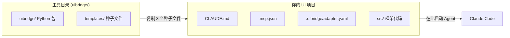
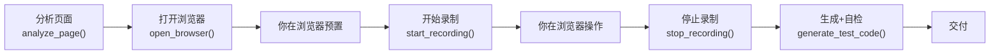

# uibridge 用户手册

**给你的企业 UI 自动化框架装上 AI 接口。不改架构、不换框架、不重构。**

---

## 概念：两个目录



| 目录 | 用途 | 启动 Agent？ |
|------|------|-------------|
| 工具目录 | 安装 uibridge、存放模板和指南 | 可以，但通常不用 |
| **UI 项目目录** | 你的测试项目，Agent 在这里帮你录制和生成 | **是，主要工作区** |

---

## 第一章：安装

```bash
git clone https://github.com/timgunnar/UIBridge.git
cd uibridge
pip install -e .                    # 可编辑安装（工具目录不能删）
playwright install chromium

uibridge --help                     # 验证
```

---

## 第二章：接入你的项目（3 步）

### 复制种子文件

| 源文件（工具目录下） | 目标位置（你的项目下） |
|----------------------|----------------------|
| `templates/CLAUDE.md` | 项目根目录 |
| `templates/.mcp.json` | 项目根目录 |
| `templates/adapter.yaml` | `.uibridge/adapter.yaml` |

```bash
mkdir -p /path/to/your-project/.uibridge
cp templates/CLAUDE.md    /path/to/your-project/
cp templates/.mcp.json    /path/to/your-project/
cp templates/adapter.yaml /path/to/your-project/.uibridge/
```

### 改一行配置

编辑 `.uibridge/adapter.yaml` — 只改 `base_package`：

```yaml
project:
  base_package: com.yourcompany.uitest  # ← 改成你的包名
```

### 启动

```bash
cd /path/to/your-project
claude
```

Agent 自动检测框架 → 扫描源码播种知识库 → 报告就绪。

---

## 第三章：日常使用



### 分析页面

```
你：分析一下 http://localhost:8080/users 这个页面
Agent：页面有 1 个 table、3 个 input、2 个 button...
```

### 录制并生成测试

```
你：帮我测用户管理的搜索功能
Agent：分析页面 → 打开浏览器 "请做预置操作，准备好后告诉我"
[你在浏览器中登录、导航等预置操作]
你：好了
Agent：开始录制 "请操作"
[你在浏览器中操作搜索功能]
你：完成了
Agent：停止录制 → 生成代码 → 自检通过 → "3 个测试，全部通过 ✓"
```

### 对比页面变化

```
你：XX 页面改版了，帮我看看哪些组件变了
Agent：调用 diff_snapshots → 列出差异
```

### 知识库自动集成

uibridge 从你的源码中学习框架约定，生成代码自动使用正确的包名和 import：

```
KB 扫描发现: package com.enterprise, 组件 WebButton
  ↓
生成代码:
  package com.enterprise.tests;              // 不是硬编码的 com.acme.tests
  import com.enterprise.components.WebButton; // 不是 com.acme.components.WebButton
```

详见 [知识库维护指南](kb-maintenance-guide.md)。

---

## 第四章：自定义适配器

如果你的框架不匹配 5 组预置适配器（如 JUnit 5 + Selenide），AI Agent 自主完成适配器开发：

```
你：我的项目是 JUnit 5 + Selenide
Agent：了解。读取 ADAPTER_GUIDE.md → 分析 pom.xml → 学习 pages/*.java → 学习 tests/*.java
       → 按 5 个接口逐一实现 → 写入 uibridge/adapter/ → 运行验证 → 更新 adapter.yaml
```

手动开发参考：[适配器开发指南](adapter-guide.md)

---

## Agent 工具参考

详细说明见 [MCP 工具参考](mcp-tools.md)。

| MCP 工具 | 用途 |
|---------|------|
| `analyze_page` | 分析页面组件 |
| `open_browser` | 打开可见浏览器（不录制） |
| `start_recording` | 在已打开的浏览器上开始录制 |
| `stop_recording` | 停止录制，保存文件，关闭浏览器 |
| `generate_test_code` | 生成代码 + 自检 |
| `diff_snapshots` | 对比页面变化 |
| `seed_knowledge_base` | 扫描源码播种 KB |
| `query_knowledge_base` | 查询框架约定 |
| `update_knowledge_base` | NL 对话式知识库增删改查 |
| `check_environment` | 检查 uibridge 运行环境 |

### CLI 命令（MCP 不可用时）

```bash
uibridge analyze --url <URL>          # 分析页面
uibridge record --url <URL> --headed  # 录制操作
uibridge generate -i <文件> -o <目录>  # 生成代码
uibridge diff -i <文件>               # 对比快照
uibridge cleanup --dry-run             # 预览将被清理的文件
uibridge cleanup --yes                 # 清理所有生成文件
```

---

## 第五章：卸载

uibridge 支持完整卸载，不留残留。

### 清理项目中的生成文件

```bash
cd /path/to/your-project
uibridge cleanup --dry-run    # 预览将被清理的内容
uibridge cleanup --yes        # 执行清理
```

`cleanup` 检测并移除：
- `.uibridge/` — 知识库目录
- `generated/` 及 `generated_*` — 生成代码目录
- `recording*.json` — 录制文件
- 模板文件（`CLAUDE.md`、`.mcp.json`、`adapter.yaml`）
- `.claude/skills/uibridge.md` — 技能文件

### 卸载 Python 包

```bash
pip uninstall uibridge -y
```

### 验证卸载

```bash
uibridge --help                    # 应报 "command not found"
python -c "import uibridge"        # 应报 ModuleNotFoundError
pip show uibridge                  # 应报 "not found"
```

---

## 支持的框架

| 适配器 | 语言 | 测试框架 | 风格 |
|--------|------|---------|------|
| `reference` | Python | pytest | ComponentAW → BusinessAW → TestScript |
| `screenplay` | Python | pytest | Screenplay Pattern |
| `java_testng` | Java | TestNG + Maven | Page Object + WebDriver |
| `java_fluent` | Java | TestNG + Maven | Fluent API + PageFactory + AssertJ |
| `custom_playwright_java` | Java | TestNG + Maven | Playwright + Page Object + AssertJ |

---

## 常见问题

**Q: 安装后 `uibridge` 命令找不到？**
A: 确保在工具目录下执行 `pip install -e .`，且 Python Scripts 在 PATH 中。

**Q: 录制时浏览器打不开？**
A: 运行 `playwright install chromium`。

**Q: Agent 说"MCP 工具不可用"？**
A: 检查 `.mcp.json` 是否在项目根目录。

**Q: 适配器不匹配怎么办？**
A: 见第四章 — AI Agent 自主完成适配器开发，无需你写代码。

**Q: 可以删除工具目录吗？**
A: 不行。`pip install -e .` 是编辑安装，Python 通过符号链接引用源码。

**Q: 生成的代码包名不对？**
A: KB 自动从源码学习包名。确认已运行 `seed_knowledge_base`。也可手动编辑 `.uibridge/adapter.yaml` 中的 `base_package`。

**Q: 测试名包含特殊字符（如 @）导致编译失败？**
A: uibridge 自动过滤非法字符，将 `zhangsan@example.com` 转为 `zhangsan_example_com`。

**Q: `java_testng` 适配器支持 JUnit 5 吗？**
A: 支持。适配器自动扫描项目源码检测 JUnit 5，生成对应的 `@BeforeEach` / `@AfterEach` 代码。

**Q: 更多文档在哪里？**
A: 见 [docs/](.) 目录下的所有指南。
